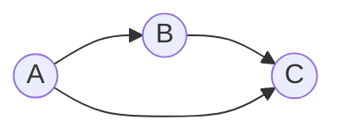

---
tags:
  - mdg
  - algorithm
  - data-structure
  - graph
  - terms
date: 2026-04-09
aliases:
  - Directed acyclic graph
  - DAG
---
## 란?

- 간단하다. 말 그대로 (1) vertex 에 "방향"이 있고, (2) cycle이 없는 (3) graph 란 소리다.