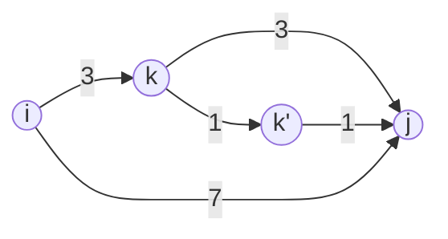

---
tags:
  - mdg
  - algorithm
  - graph
  - terms
  - floyd-warshall
date: 2026-04-09
aliases:
  - Floyd-Warshall
---
> [!tip] 이놈을 사용하는 코테문제
> - 본 작물의 backlink를 확인하거나
> - #floyd-warshall 태그로 검색해보자.

## Problem

- Floyd-Warshall 알고리즘이 풀려고 하는 문제는 "최단경로 계산" 이다.

## Condition

- 이 알고리즘을 적용할 수 있는 조건은 "음수 사이클" 이 없어야 한다는 것이다.
	- 즉, `A->B` `B->C` `C->A` 에서 각각의 weight가 `-2`, `-3`, `1` 이면, `A->B->C` 를 한바퀴 돌았을 때 `-4` 가 되므로 계속 돌면 음의 무한대로 가게 된다.

## Key Idea

- 핵심 아이디어는 전체 노드 집합의 임의의 세 노드 조합 `{i, j, k}` 에 대해, `i->j` 로 가는 것 보다 `i->k->j` 로 가는 것이 더 weight가 작은지를 검사해서 `i->j` 에 대한 최소 weight를 찾는 것이다.

## 주의할 점

- 모든 `{i, j, k}` 조합에 대해 검사해야 하므로 3중 loop 를 돌게 코드를 짜면 된다. 다만, outmost loop 이 `k` (즉, 경유 노드) 가 되어야 한다.

### 틀린 loop 설명

- 만약에 `i, j, k` 의 순서대로 inner loop 를 구성했다고 해보자. 이건 다르게 생각하면, 어떤 출발-도착 조합 `i->j` 에 대해, 모든 `k` 를 경유노드로 검사하며 최소 weight를 찾는다는 것이다.

```cpp
for (int i = 0; i < N; i++) {
	for (int j = 0; j < N; j++) {
		for (int k = 0; k < N; k++) {
			...
		}
	}
}
```

- 하지만 이것은 전제가 필요하다: `i->k->j` 의 최소 weight를 알려면, `i->k` 와 `k->j` 의 최소 weight를 알아야 가능하다.
- 당연하게도 이건 보장이 안된다. 예를 들어 `1->2` (`i=1, j=2`) 의 최소 weight 를 찾기 위해 `1->3->2` (`i=1, j=2, k=3`) 를 판단하고자 하면, `1->3` (`i=1, j=3`) 의 최소 weight가 결정되어있어야 하지만 `j=3` 은 아직 처리하지 않은 상태이기 때문에 불가능하다.

### 올바른 loop 설명

- 하지만 반대로 `k, i, j` 의 순서대로 inner loop 를 구성하면 어떨까?

```cpp
for (int k = 0; k < N; k++) {
	for (int i = 0; i < N; i++) {
		for (int j = 0; j < N; j++) {
			...
		}
	}
}
```

- 이건 이렇게 생각할 수 있다: 어떤 경유노드 `k` 에 대해, 이 노드를 지나가는 모든 경로의 weight를 업데이트하는 것이다.
- 이건 [[#틀린 loop 설명|위]] 처럼 생각하면 이렇게 된다: 이때도 `i->k->j` 의 weight를 계산하지만, `i->k` 와 `k->j` 의 최소 weight가 확정되어있어야 할 필요는 없다.
- 왜냐면 이 접근법은 `i->j` 에 대한 최소 weight를 "확정"하는 것이 아닌, `k` 를 거쳐갈 때의 최소 weight를 "반영"하는 것에 불과하기 때문이다.



- 가령 위의 그래프를 생각해 보자:
	- 경유노드를 `k`, `k'` 순서로 잡아 처리하는 경우에 어떻게 `i->j` 의 최소값을 구하는지 보자.
	- 우선 `k` 를 경유노드로 정하는 경우에 `i->j` 인 7보다 `i->k->j` 인 6이 더 weight가 적기 때문에 `i->j` 의 최소 weight는 6으로 업데이트된다.
		- 아직 `k'` 를 경유노드로 삼았을 때를 처리하지 않았기 때문에, `k->j` 의 최소 weight는 아직까지는 3이다. 그래서 $3+3=6$ 이 된다.
	- 하지만 `k->j` 의 "최소" weight는 3이 아니라 2이다. 이건 `k` 를 처리한 후 `k'` 를 경유노드로 지정했을 때 반영된다.
		- 우선, `k` 가 경유노드일 때의 weight는 전부 반영이 되어 있기 때문에, `i->k'` 의 최소 weight는 4로 계산되어 있다.
		- 따라서 `k'` 를 경유노드로 잡았을 때 `i->k'` 의 최소가 4이고, `k'->j` 의 최소는 1이기 때문에, `i->j` 의 최소가 5로 업데이트된다.
- 즉, 이렇게 계산하면 `i->k->j` 를 고려할 때 `i->k` 혹은 `k->j` 의 최소 weight 가 정확하지 않아도 된다. 나중에 다른 경유노드를 계산하며 조정되기 때문이다.