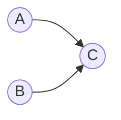

---
tags:
  - mdg
  - algorithm
  - graph
  - terms
  - topology-sort
date: 2026-04-09
aliases:
  - Topological Sort
  - 위상정렬
---
> [!tip] 이놈을 사용하는 코테문제
> - 본 작물의 backlink를 확인하거나
> - #topology-sort  태그로 검색해보자.

## Problem

- [[Directed Acyclic Graph, DAG (Data Structure)|DAG]] 을 "위상(topology)"를 기준으로 정렬하는 방법이다.
- 이 "위상"이라는건 [[Dependence (Arch)|Dependence]] 같은거라고 생각하면 된다. 가령 아래의 그래프를 보자.

- 여기서 `C` 는 `A` 와 `B` 모두에게 의존하고 있다. 따라서 위상을 기준으로 정렬하면 `C` 가 첫번째가 된다.
- 그리고 `A` 와 `B` 는 의존관계가 없다. 따라서 이 둘은 선후관계가 아니기 때문에, 최종적인 위상정렬의 결과는 `{C, A, B}`, `{C, B, A}` 둘 다 정답이다.

## Condition

- 위에서 말한것 처럼, [[Directed Acyclic Graph, DAG (Data Structure)|DAG]] 여야 한다. Cycle이 있으면 닭이 먼저냐 달걀이 먼저냐가 되기 때문에 정렬이 불가능하다.

## Key Idea

- 이것을 코드로 구현할 때 가장 핵심적인 idea 는, "진입점이 없는 노드에서부터 시작해서 BFS를 돌리는 것"이다.
	1. 우선 각 노드의 진입점이 몇개인지를 count하는 vector를 하나 만들어서 빌드한다. 이놈을 `in_degree` 라고 하자.
	2. Queue를 만들어서, 진입점이 없는 node들을 queue에 다 넣는다.
	3. Queue가 비어있지 않는 한, 다음을 반복한다.
		1) Queue에서 node하나를 pop한다.
		2) 이놈에서 출발하는 모든 다음 node에 대해, `in_degree` 에서의 값을 1씩 감소시킨다. 즉, 이렇게 하면 현재 node를 graph에서 제거하는 셈이 된다.
		3) 만약 `in_degree` 에서 1을 감소했더니 0이 되는 다음 node는, 현재 node를 제거한 다음에는 진입점이 없다는 것이기 때문에 이놈을 queue에 추가한다.