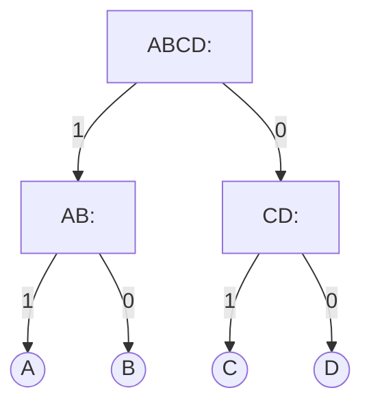
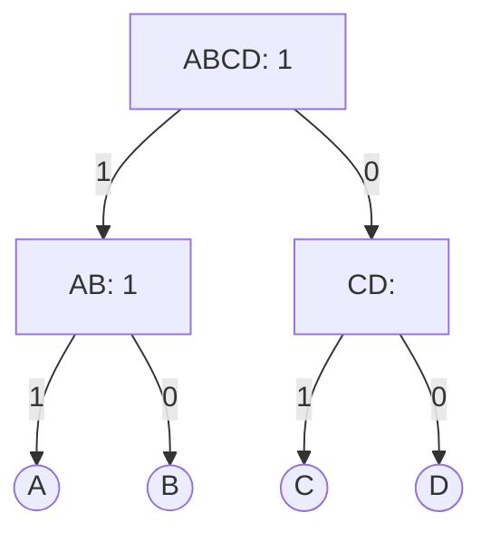
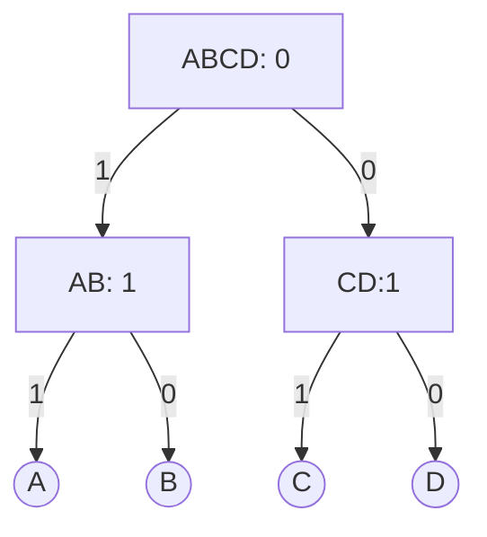

---
tags:
  - originals
  - snu-shpc24f
date: 2024-10-09
---
> [!info] 서울대학교 컴퓨터공학과 이재진 교수님의 "확장형 고성능 컴퓨팅" 강의를 필기한 내용입니다.
> - [[(SNU CSE) Scalable High-Performance Computing|목차]]

## Locality

- 일단 Locality 는 간단히 말하면 "조만간 사용될 것임" 을 뜻하는 것으로 생각하면 되고
- [[Locality (Replacement)|Temporal locality]] 는 시간의 측면에서의 locality 를 말한다.
	- 어떤 데이터를 참조했을 때의 "시점" 을 기준으로 가까운 시간 내에 다시 접근될 것이라는 것.
	- 즉, 최근에 사용되었던 애는 조만간 다시 사용될 것이라는 예측이다.
- [[Locality (Replacement)|Spatial locality]] 는 공간의 측면에서 locality 를 말한다.
	- 어떤 데이터를 참조했을 때 이놈의 "위치" 를 기준으로 가까운 위치의 데이터를 접근할 것이라는 것.
	- 즉, 사용되었던 애의 주변에 있는 애들도 조만간 사용될 것이라는 예측이다.

![[Pasted image 20241021100533.png]]

- 따라서 위의 serial addition 에도 위의 locality 가 모두 들어간다.
	- `A` 는 인접한 entry 가 계속 접근되니까 spatial locality 이고
	- `sum` 은 같은 곳에 계속 접근하니까 temporal locality

![[Pasted image 20241021100740.png]]

- 이건 data 에만 한정된 내용이 아니다; code 에서도 이런 locality 가 적용이 된다. 가령 위의 예시에서도
	- Loop 을 도는 동안 `L3` 가 반복해서 접근되므로 이곳은 temporal locality 가 있는 것이고
	- Instruction 실행 후에는 다음 instruction 을 사용하니까 이런 점에서는 spatial locality 가 있는 것.

## Memory hierarchy

![[Pasted image 20241021101314.png]]

- 뭐 이렇게 [[Memory Hierarchy (Memory)|Memory hierarchy]] 가 있는거는 알테고
- Memory 도 storage 에 비하면 cache 의 역할을 하지만 replacement 같은 것이 SW 로 구현되어있다는 점에서 SW cache 라고 부르고
	- CPU cache 는 replacement 도 HW 적으로 되어 있기 때문에 HW cache 라고 부른다.
- 참고) DRAM 에 비해 SRAM 은 더 빠르지만 transistor 도 더 많이 들어가 비싸다고 한다.

## [[CPU Cache (Arch)|Cache]]

- Cache 가 필요한 이유는 instruction 을 실행하는데 이놈이 memory 에 있기 때문.
	- Memory 에 갔다오는 시간이 대략 300cycle 정도 걸리기 때문에
	- Instruction 실행하는데는 1cycle 인데 이놈 가져오는게 300cycle 이면 배보다 배꼽이 더 크다.
- Memory 에서 cache 로 올리는 비용이 있기 때문에 당연히 locality 를 고려해서 cache 를 사용해야 한다.
	- 즉, 한번 cache 로 올리는 비용이 비싸기 때문에 한번 올리고 여러번 써먹기 위해 어떤 놈이 "조만간 사용될" 지를 고려해야 하는 것.
	- Temporal locality 의 관점에서는, 한번 access 되었으면 cache 에 올라왔기 때문에 이것을 올리는 것보다는 "언제 뺄지" 가 중요하다. 이것은 뒤에 replacement 로 결정된다.
	- Spatial locality 의 관점에서는, access 된놈만 올리는게 아니라 주변 애들을 다 같이 올린다. 이 단위를 *Cache line* 이라고 한다.
	- 따라서 cache 로 올리는 비용을 생각하면, 한번만 access 되는 놈이라면 cache 에 올리는게 더 손해일수도 있다.
- 어쨋든 cache access 관련하여 두 개의 주된 result 는
	- *Hit*: 원하는 놈 $b$ 가 $k$ 번째 level 안의 cache line 에 있는 경우
	- *Miss*: 없는 경우. 이때는 $k+1$ 번째 level 에서 $k$ 번째로 $b$ 가 포함된 cache line 을 올려야 한다.
		- 여기에는 종류가 있다.
		- *Cold miss*: cache 가 비어있을 때
		- *Conflict miss*: cacheline 이 들어올 자리가 없을 때
		- *Capacity miss*: 단위시간동안 사용하는 데이터의 크기 (= *Working set*) 가 cache 의 크기보다 클때
			- 근데 사실 이건 conflict miss 랑 구분하기가 힘들다고 한다.

### Cache line

![[Pasted image 20241021105012.png]]

- 일단 *Word* 라는 것은 "한 자료형 단위" 라고 생각하면 된다.
	- 즉, 자료형이 `int` 면 *Word* 의 크기는 4byte 인 것.
- 위에서 말한 대로, spatial locality 를 위해 *Cache line* 의 단위로 데이터를 갖고 온다.
	- 이것은 여러 개의 word 로 구성된다.
- 그리고 cache line 과 동일한 크기의 memory 공간으로, memory 에서 cache 로 한꺼번에 갖고 오게 되는 memory 의 영역은 *Cache block* 이라고 부른다.
	- 여기서 좀 용어가 섞일 수 있는데,
	- 보통 *Memory block* (*block*) 이라고 하면 *word* 라고 생각하고,
	- *Cache block* 이라고 할 때만 *Cache line* 에 대응되는 놈이라고 생각하자.

### Structure

![[Pasted image 20241021105657.png]]

- Memory address 로 cache 에 접근하기 위해서 위처럼 구성되어 있다.
- 일단 전체 구조는 $S$ 개의 set 이 있고, 각 set 에 $L$ 개의 cache line 이 있으며 이 cache line 은 $B$ 개의 byte 로 구성된 형태다.
	- 각 cache line 에 대해서는 cache line 들을 구분지어주기 위한 tag 와
	- Cache line 이 유효한지를 나타내는 validity bit 이 있다.
- 보통 cache size 라고 한다면 저 valid 나 tag 는 제외한 크기를 말한다.
	- 즉, $L \times S \times B$ 인 것.
- 이때, 원하는 address 의 byte 에 접근하는 방법을 알아보자.
- Set 을 찾아가는 것은 address 의 set index field 를 참고해서 어느 set 에 있는지 알아낸다.
- Set 내에서 원하는 cacheline 을 찾는 것은 address 의 tag field 를 참고한다.
	- 얘는 index 로 접근하는게 아니라 cache line 에 적힌 tag 를 비교해서 찾아낸다.
- Cache line 안에서 byte 를 찾는 것은, memory address 의 나머지 부분을 offset 으로 해서 찾아가게 된다.

## Cache Types

### [[Direct-mapped Cache (CPU Cache)|Direct-mapped cache]]

![[Pasted image 20241203182925.png]]

- 간단하다: $L = 1$ 일때를 *Direct-mapped Cache* 라고 부른다.
- 접근하는 것은 아주 쉽다.
	- Set index 를 보고 해당 set 으로 간다.
	- Tag 를 보고 원하는 cacheline 인지 확인한다.
	- 만약에 맞다면, 그냥 사용하면 되고, 아니라면 이놈을 빼버리고 원하는 cacheline 을 가져오면 된다.
- 따라서 replacement 도 간단하다: 뭐 victim 선정 이런거 없이 tag 안맞으면 빼버리면 되니까.
- 이걸 회로로 나타내보면 이렇게 그릴 수 있다.

![[Pasted image 20241203190909.png]]

- 위에서 말한대로,
	- Set index 로 set 을 정하고
	- Tag 를 비교해서 hit 인지 아닌지 알려주고
	- Offset 으로 해당 offset 의 word 를 찾아서 그것도 알려준다.
		- 참고로 저기 등변사다리꼴은 Multiplexer (MUX) 로, index access 와 비슷하게 입력값 $N$ 으로 $N$ 번째 입력값을 뱉는 역할을 한다.

#### Access Example

- Access 예시를 보자.

![[Pasted image 20241203191312.png]]

- 각 색깔은 word (4byte) 이고 이때 cacheline 은 word 두개 크기 (8byte) 이다.
	- 따라서 offset 은 cacheline 이 8byte 이기 때문에 3bit 이다.
- Set 이 4개이면 Set index 는 2bit 면 될 것이다.
- 그리고 Tag 는 1bit 를 사용해 총 6bit address space 라고 해보자.
- 이때 address 0 (주황색) 에 접근했을 때의 모습이 위 그림이다.
	- Set 0 의 validity 가 0이었기 때문에, cache miss 가 나고 해당 cacheline 이 올라오게 된 것.
	- 따라서 이때는 저 주황색이 cache miss 에 의해 올라온 것이고, 그 옆의 연두색은 cacheline 단위로 올라오느라 prefetch 된 것이다.

![[Pasted image 20241203191759.png]]

- 그래서 다음 address 4 (연두색) 에 접근하면 hit 가 나게 된다.

![[Pasted image 20241203192036.png]]

- 동일하게 address 20 에 접근하면 miss 가 나게 되고, set index 가 `10` 이기 때문에 set 2 에 올라온다.

![[Pasted image 20241203192145.png]]

- 이때 address 48 에 접근하게 되면 conflict 가 나게 된다.
	- 이놈도 동일하게 set index 가 `10` 이고 심지어 validity bit 도 켜져있는데 tag 가 다르기 때문 (address 20 은 `0`, 48 은 `1`).
- 따라서 아래처럼 address 48 의 cacheline 이 올라오게 된다.

![[Pasted image 20241203192428.png]]

### [[Set Associative Cache (CPU Cache)|Fully associative cache]]

![[Pasted image 20241203192713.png]]

- Direct-mapped cache 는 간단하긴 하지만 cache miss 가 너무 많이 난다.
	- Tag 가 다르면 그냥 숙청되기 때문.
- 그럼 반대로, set 을 1개만 사용하면 어떻게 될까. 이것이 *Fully-associative cache* 이다.
- 이때는 cache miss 시에 그냥 set 의 빈자리에 cacheline 을 밀어넣는다.
- "빈자리" 에 넣는다는 것이 중요하다.
	- 덕분에 cache evict 가 많이 줄어들게 된다. Direct-mapped cache 의 경우에는 cache 가 많이 비어있어도 정작 내가 들어가야 하는 set 이 차있으면 evict 시켜야 하기 때문.
	- 따라서 evict 가 발생하는 것은 진짜 cache 가 전부 차있을때 이므로 그만큼 utilization 이 좋다고 할 수 있다.
- 하지만 당연히 단점이 있는데, 그것은 복잡해진다는 것이다.
	- 모든 cacheline 의 tag 를 비교해야 하고, 이것을 linear 하게 하는 것은 불가능하기 때문에 (SW 가 아닌 HW 이므로) 한번에 tag 를 비교하기 위해 위처럼 복잡한 회로가 추가된다.
	- 그리고 evict 시에 victim 을 선정할 필요도 생긴다. 이를 위해 replacement 를 위한 회로도 추가된다.

### Set Associative Cache

![[Pasted image 20241203193816.png]]

- CS 에서는 항상 trade-off 가 있으면 그 중간놈도 존재하는 법이다.
- Direct-mapped cache 는 간단하지만 miss 가 자주 일어나는 문제가 있었고, Fully-associative cache 는 그 반대였기 때문에, 그 중간지점인 적절한 개수의 set 과 적절한 개수의 line 을 사용하는 놈을 생각하게 되는 것.
- 이것이 *Set Associative Cache* 이다.
- 위 그림을 보면, 좀 복잡해 보이긴 하지만 cacheline 두개가 연달아 붙어있는 형태이다.
	- 일단 set index 로 해당 set 으로 찾아가면, 여기에는 cacheline 이 두개가 있다.
	- 이 두 cacheline 에 대해, tag 를 한번에 비교하고 맞는놈에 대한 cacheline 에서 offset 으로 가져오게 되는 것.
- 여기서 set 하나에 몇개의 line 을 둘 것이냐에 따라 *N-way* 라고 부른다.
	- 2개 있으면 2-way, 4개면 4-way 등등

## Cache Replacement

- Cache 하면 항상 나오는 주제가 replacement 이다. 빠르게 (모르던 것들은 자세히...) 알아보자.

### [[Least Recently Used, LRU (Replacement)|LRU]]

- 안쓴다. 사실 그대로 쓰는데가 거의 없는거같다. 이유를 현실적으로 생각해 보자.
- 간단하게 생각하면 된다. LRU 를 위해서는 "순서" 를 저장해야 하는데, 이 순서의 경우의 수는 factorial 이고, 이를 이용해 계산해 보면 필요한 bit 가 생각보다 많기 때문.
	- 2-way 면 $2! = 2$ 이므로 1bit 면 되지만
	- 4-way 면 $4! = 24$ 이므로 5bit 가 필요하고
	- 8-way 면 $8! = 40320$ 이므로 16bit 가 필요하다.

### [[First In First Out, FIFO (Replacement)|FIFO]]

- 안쓴다. 이유는 locality 가 하나도 고려되지 않기 때문.

### RANDOM

- 신기하게도 이놈은 쓴다. ARM 에서는 이걸로 replacement 를 한다고 한다.

### [[Pseudo-LRU (Replacement)|Pseudo-LRU]]

- 이것은 decision tree 를 이용한 LRU approximate algorithm 이다.
- 핵심 아이디어는 binary tree 에서 node 의 값이 1이면 왼쪽 놈이 최근에 사용되었다는 의미이고, 0이면 오른쪽 놈이 최근에 사용되었다는 의미라고 정하고 access 될때 경로상에 있는 node 들의 bit 를 그에 맞게 바꿔 가장 이전에 사용되는 놈을 찻게 하는 것이다.

#### 예시

- 예시를 보자. 다음과 같은 decision tree 가 있을때


- 만약 A 에 접근한다면, A 까지 가는 경로는 ABCD -> AB -> A 이다. 이때 가야하는 child 를 node 에 적어주면 다음과 같다.

- 따라서 A 가 접근되면, node 들의 bit 는 다음처럼 될 것이다.

| ACCESS | ABCD | AB  | CD          |
| ------ | ---- | --- | ----------- |
| A      | 1    | 1   | not changed |

- 다음은 C 에 access 되었다고 해보자. 그럼 ABCD -> CD -> C 이므로 node 에는 다음처럼 표시해 주면 될 것이다.

- 그럼 C 가 접근되었을 때의 경우의 수도 위의 표에 추가를 해보자.

| ACCESS | ABCD | AB          | CD          |
| ------ | ---- | ----------- | ----------- |
| A      | 1    | 1           | not changed |
| C      | 0    | not changed | 1           |

- 마친가지의 과정을 B 와 D 에 대해서도 생각해 보면, 다음과 같이 표가 만들어 진다.

| ACCESS | ABCD | AB          | CD          |
| ------ | ---- | ----------- | ----------- |
| A      | 1    | 1           | not changed |
| B      | 1    | 0           | not changed |
| C      | 0    | not changed | 1           |
| D      | 0    | not changed | 0           |

- 이렇게 access table 을 완성했다. 그럼 victim 은 어떻게 고를까.
- 아래의 상황에서 새로운 `E` 가 들어온다고 해보자.

- 일단 `ABCD` 가 `0` 이기 때문에 right child 보다 left child 의 애들이 더 예전에 접근되었을 것이다.
- 또한, `AB` 는 `1` 이기 때문에 left child 보다 right child 의 애들이 더 예전에 접근되었을 것이다.
- 따라서 victim 은 B 가 된다. 이것을 표로 나타내면

| ABCD | AB  | CD             | VICTIM |
| ---- | --- | -------------- | ------ |
| 0    | 1   | doesn't matter | B      |

- 이 원리를 확장해 저 표를 완성해보면

| ABCD | AB             | CD             | VICTIM |
| ---- | -------------- | -------------- | ------ |
| 0    | 0              | doesn't matter | A      |
| 0    | 1              | doesn't matter | B      |
| 1    | doesn't matter | 0              | C      |
| 1    | doesn't matter | 1              | D      |

- 이렇게 victim table 또한 완성할 수 있다. 이 access table 과 victim table 을 이용해 replace 하는 것이 *Pseudo-LRU* 이다.

#### Performance

- 일단 성능으로 보자면, LRU 와 Pseudo-LRU 는 통계적으로 봤을때 miss rate 차이가 아주 적다고 한다.
- 또한 필요로 하는 bit 의 개수를 보면,
	- LRU 의 경우에는 cache size 가 4라면 $4! = 24$ 이므로 5bit 가 필요하다.
	- 하지만 Pseudo-LRU 의 경우에는 보다시피 3bit 만 있으면 된다.
	- 이것을 $N$ 으로 확장시키면, $(2^{log_{2}(N+1)}-1)-N$ 이라고 한다.

## Cache Write Policies

> [!info] 여기부터는 `2024-10-14` 강의임

- Read 는 access pattern 에 따라 좀 성능이 달라질 수 있다.
	- Sequential access 의 경우에는 cacheline 을 읽어와서 이후 한동안 hit 가 나 성능이 좋지만
	- Random access 의 경우에는 miss 가 날 뿐 아니라 한번 읽는데에도 cacheline 단위로 올라오기 때문에 읽어야 할 양이 많아서 오히려 느려질 수 있다.
		- 때문에 이때는 그냥 memory 를 바로 읽는게 나을 수도 있다.
- Write 는 read 에 비해 좀 다른 구석이 있다.
	- Read 는 tag 비교와 offset 으로 값을 가져오는 것을 동시에 할 수 있다.
		- 즉, tag 를 비교한 다음에 일치하면 값을 읽어오는게 아니라 tag 과 값을 같이 가져와서 tag 가 안맞으면 버리는 방식을 취한다.
	- 하지만 write 는 그렇게 못한다. Tag 가 다른데 write 를 해버리면 안되기 떄문.

### Hit policy

- Write 시에 cache hit 이 발생하면, 두가지 policy 가 가능하다.
- *Write through*: Cache 와 mem 둘 다 write 하는 것
	- 당연히 느리다.
	- 근데 구현이 쉽기도 하고, 항상 cache 와 mem 의 데이터가 일치하기 때문에 consistency 문제가 없다.
- *Write back*: Cache 에만 write 하는 것
	- 당연히 빠르다 (read 와 write 의 속도가 같다).
	- 그럼 언제 mem 에 write 되냐: evict 시에 수행한다.
		- 즉, dirty bit 를 유지해야 한다는 소리.
	- 또한 cache 와 mem 간의 consistency 문제가 있다.
	- 하지만 빠르다. 그래서 보통은 이 정책을 사용한다.

### Miss policy

- Write 시에 miss 가 발생하면, 이때에도 두가지 policy 가 가능하다.
- *Write allocate*: Cache 로 갖고와서 write 하기
- *No write allocate*: Cache 로 갖고오지 않고 mem 에 바로 write 하기

### Mix

- 저 hit policy 와 miss policy 두개를 섞어보자.
- *Write through* + *Write allocate*
	- 모든 write 는 cache 와 mem 에 전부 적힌다.
- *Write through* + *No write allocate*
	- 모든 write 는 mem 으로 가고, hit 일때는 cache 내용도 바뀐다.
- *Write back* + *Write allocate*
	- Sequential write 에 아주 좋다: Write allocate 로 miss 시에 가져온 뒤에는 한동안 hit 이 나고, cache 에만 적으므로 (Write back) 매우 빠르다.
- *Write back* + *No write allocate*
	- 데이터가 있는곳에만 적는다. Cache 에 있으면 cache 에만 적고, mem 에 있으면 mem 에만 적는다.

## Non-blocking, Lockup-free Cache

- Cache 는 miss 가 나면 그놈을 가져오는 동안에는 다른애들은 block 되는데 이건 당연히 성능상 좋지 않다.
- 그래서 miss 가 처리되는 동안 다른 hit 들은 제공해 주거나, 추가적인 state 를 이용하는 방법이 있다.
	- 이런 애들을 Non-blocking, Lockup-free cache 라고 부르는듯
	- 저 state 는 Miss Status, Information Holding Register (MSHR) 라고 부른다.
	- 더 깊게는 들어가지 말자.

## Metrics

- Cache 의 성능을 판단하는 metric 은
	- *Miss rate*: 얼마나 miss 가 자주 일어나는지
	- *Hit time*: hit 시에 얼마나 빠르게 cache line 의 내용을 CPU 에게 전달하느냐
	- *Miss penality*: miss 시에 mem 에서 가져오는게 얼마나 걸릴 것이냐