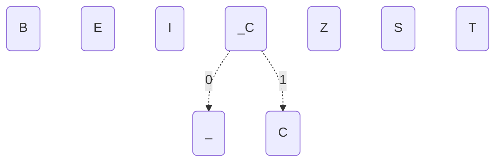
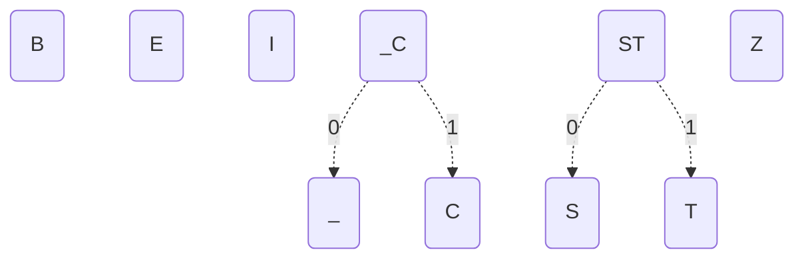
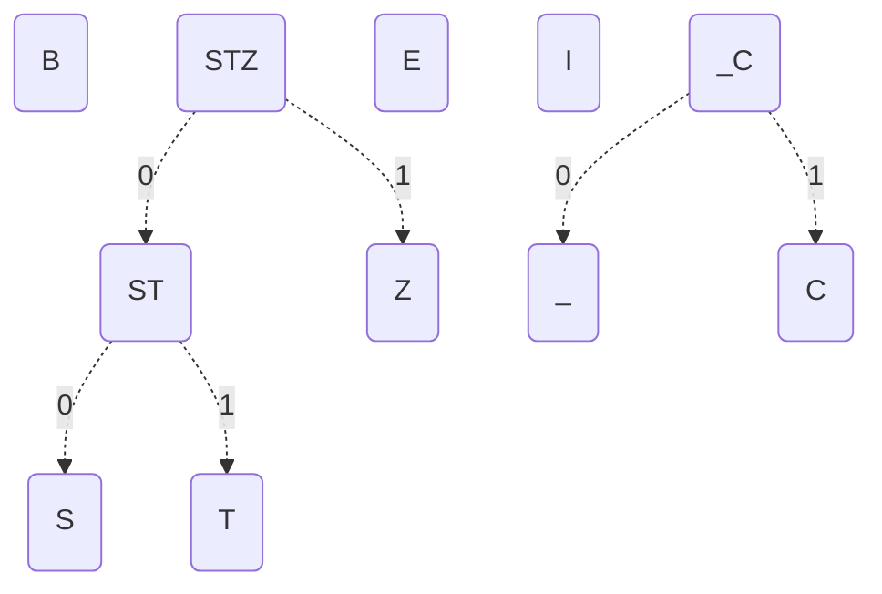
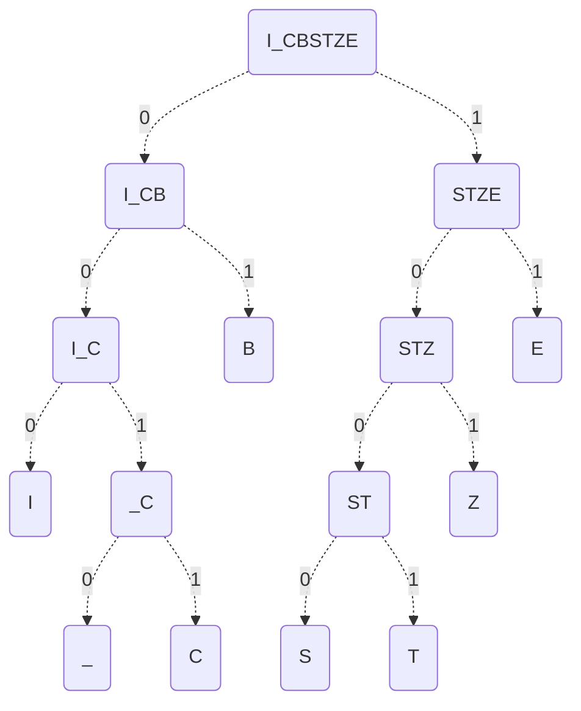
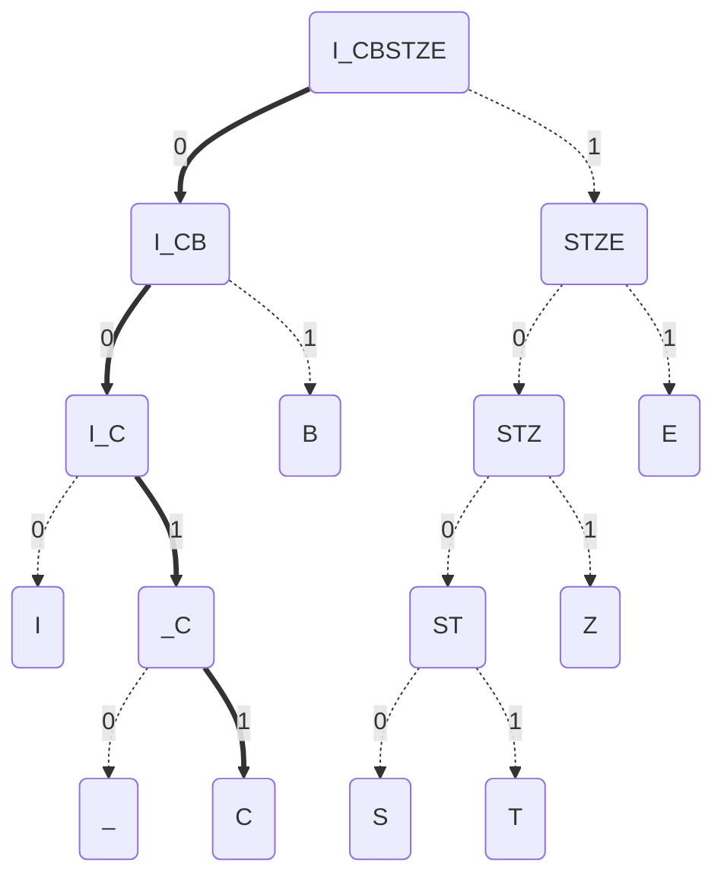
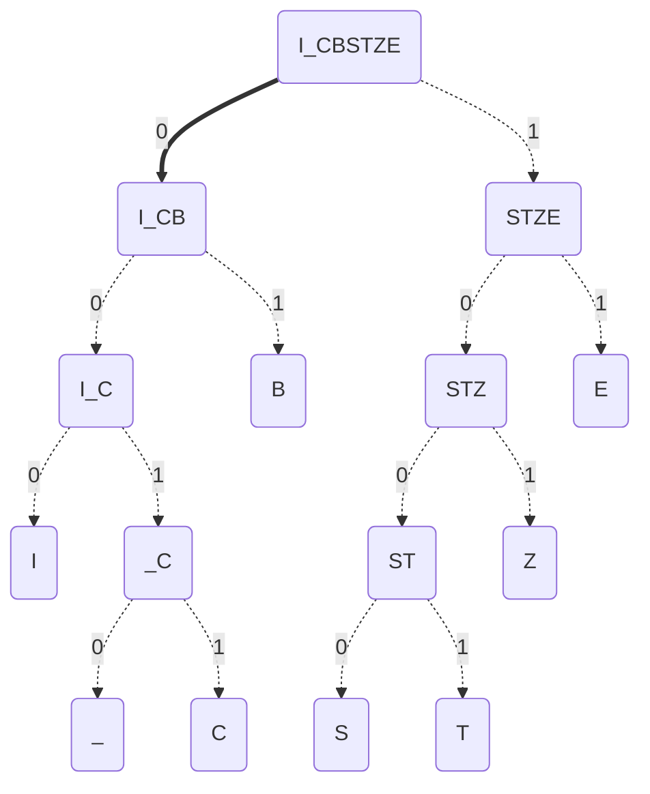
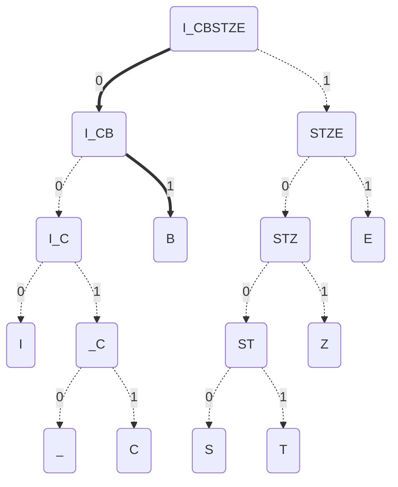

---
tags:
  - Database
  - db-encoding
date: 2024-07-30
---
> [!info]- 참고한 것들
> - [왜 BBC에서 이런 글을 적는지는 나도 모른다.](https://www.bbc.co.uk/bitesize/guides/zd88jty/revision/10)
> - [우끽피디아](https://en.wikipedia.org/wiki/Huffman_coding)

## 허프만 코딩

- 유명한 Lossless compression 기법이다.

### 기본 아이디어

- 가령 어떤 문자열을 저장할 때, 좀 더 공간사용량을 줄이고 싶다고 해보자.

#### 첫번째 아이디어는 적은 수의 bit 를 사용하는 것이다.

- 그럼 문자 하나는 1byte, 즉 8bit 인데 문자열에 포함된 문자의 종류가 $2^{8}$ 개가 아니라면 굳이 8bit 전부를 사용할 필요가 없을 것이다.
	- 만약 문자열에 등장하는 문자의 개수가 8개라면, 3bit 로도 충분할테니까.
- 따라서 문자의 개수에 따라 기존의 8bit 가 아닌 더 적은 수의 bit 를 사용하여 문자를 표현한다면, 데이터의 사이즈가 훨씬 줄어들게 된다.

#### 두번째 아이디어는 "빈도 (Frequency)" 이다.

- 만약 자주 등장하는 문자는 더 적은 bit 로 표현하고, 덜 자주 등장하는 문자는 비교적 많은 bit 로 표현하면 위의 아이디어에서 더욱 데이터 사이즈를 줄일 수 있을 것이다.
- 가령 문자열에서 'E' 가 가장 빈도가 높다면 이것을 `1` 로 표현하고, 만약 두번째로 빈도가 높은 문자가 'S' 라면 이것을 `01` 로 표현하는 식으로 할 수 있을 것이다.

#### 세번째 아이디어는 minheap 과 binary tree 를 이용한 prefix code 생성이다.

- (2) 에서 말한 것을 보면 뭔가 좀 이상하다고 생각할 수 있다.
	- 만약 'E', 'S', 'A' 순서대로 빈도가 높아, 각각 `1`, `01`, `101` 로 표현하기로 해보자.
	- 그럼 만약 `101` 를 보고 이것을 'A' 라고 판단해야 할까 아니면 'ES' 라고 판단해야 할까?
- 이런 모호함이 없는 code (치환될 bit) 를 생성해야만 (2) 번의 "빈도" 아이디어가 성립할 것이다.
- 이때 이런 모호함이 없는 code 기법중 하나가 *[[Prefix Code (Encoding)|Prefix code]]* 이다.
	- 이것은 *Prefix Free Code* 라고도 불리는데, 쉽게 말하면 "한 code 가 다른 code 의 prefix 로 들어가지 않게 하는 것" 를 의미한다.
	- 가령 위에서의 `101` 예시를 보자.
		- 여기서 저런 모호함이 생긴 이유는 'E' 의 `1` 과 'A' 의 `101` 이 prefix 가 `1` 로 동일하기 때문이다.
		- 만약 'A' 를 `001` 로 표현한다면, 이놈의 prefix 인 (`0`, `00`, `001`) 와 일치하는 code 가 없기 때문에 모호함이 발생하지 않는다.
		- 즉, `001` 는 ('`0`S' 라는 억지를 부리지 않는 한) 'A' 로 밖에 해석될 수 없다.
- 근데 이런 *Prefix Code* 는 어떻게 생성할까? 문자의 개수가 적으면 사람이 짱구를 굴려 할 수 있겠지만, 문자의 종류가 많거나 가변적이어서 동적으로 이 code 를 생성해줘야 한다면?
	- 이것에 대한 해답이 저 *Minheap* 와 *Binary Tree* 이다. 이건 아래 과정을 보면서 이해해 보자.

## BBC BITESIZE 예시

- 여럿 글을 뒤져본 결과 [이 글](https://www.bbc.co.uk/bitesize/guides/zd88jty/revision/10)이 제일 알기 쉬웠다.
- 일단 다음의 문자열을 담가본다고 해보자.

```
BBC_BITESIZE
```

### Minheap 으로 Prefix Code 생성하기

- 그럼 이때 각 문자들의 빈도를 내림차순으로 하여 minheap 을 구성하면 다음과 같다고 할 수 있다.

| CHAR | CNT |
| -- | --- |
| `B`  | 3   |
| `E`  | 2   |
| `I`  | 2   |
| `Z`  | 1   |
| `S`  | 1   |
| `T`  | 1   |
| `_`  | 1   |
| `C`  | 1   |

- 그리고 여기서 각각의 *CHAR* 에 대한 binary tree 를 하나 그려보자.
	- 일단 아래와 같이 모두 parent 없이 [^parent] child node 만 있다고 생각하자. 어떻게 Parent 가 구성되는지는 바로 다음에 나온다.


- 여기서 가장 빈도가 낮은 2놈을 합친다.
	- 즉, 저 `_` 와 `C` 를 합쳐 보자.
	- 이때, *CHAR* 은 둘을 합친 `_C` 가 되고, *CNT* 는 두 *CNT* 값을 더한 2 가 된다.
- 그럼 이제 새로 함쳐진 놈에 대해 새로 minheap 와 binary tree 를 그려보자.

| CHAR | CNT |
| ---- | -- |
| `B`  | 3   |
| `E`  | 2   |
| `I`  | 2   |
| `_C` | 2   |
| `Z`  | 1   |
| `S`  | 1   |
| `T`  | 1   |



- 보면 어떻게 parent node 가 구성되는지 알 수 있을 것이다.
	- 두 node 가 합쳐지면 합쳐진 놈은 parent 로, 원래의 node 가 child 로 들어간다.
	- 그리고 각 child node 로 가는 화살표에는 0, 1 을 붙인다. 편의를 위해 왼쪽은 0, 오른쪽은 1 이라고 하자.
- 한번 더 해보자.

| CHAR | CNT |
| -- | -- |
| `B`  | 3   |
| `E`  | 2   |
| `I`  | 2   |
| `_C` | 2   |
| `ST` | 2   |
| `Z`  | 1   |



- 마지막으로 한번만 더 해보자.

| CHAR  | CNT |
| --- | -- |
| `B`   | 3   |
| `STZ` | 3   |
| `E`   | 2   |
| `I`   | 2   |
| `_C`  | 2   |



- 이런식으로 계속 하다 보면 결과적으로 다음과 같이 된다.



- 이것을 가지고 어떤 문자의 Prefix code 를 찾는 것은 root 에서 시작해 해당 문자가 나올때 까지 binary tree 를 따라 내려오면 된다.
- 가령, `C` 의 prefix code 는 다음과 같은 과정을 통해 `0011` 가 되는 것을 알 수 있다.



- 마찬가지의 과정으로 모든 prefix code 를 전부 계산해 보면 이렇게 된다.

| CHAR | CNT | CODE   |
| ---- | --- | ------ |
| `B`  | 3   | `01`   |
| `E`  | 2   | `11`   |
| `I`  | 2   | `000`  |
| `Z`  | 1   | `101`  |
| `S`  | 1   | `1000` |
| `T`  | 1   | `1001` |
| `_`  | 1   | `0010` |
| `C`  | 1   | `0011` |

- 보다시피 완벽하게 prefix-free 하고, frequency 가 클수록 적은 bit 로 표현된 것을 볼 수 있다.

### Prefix code 로 compression 하기

- 이것으로 주어진 문자열을 compression 해보면 결과적으로 다음과 같이 된다.

```
01010011001001000100111100000010111
```

### Binary tree 로 decompression 하기

- 반대로 이것을 decompression 하는 것은 어떻게 할까.
- 저 bit stream 을 그대로 binary tree 에 집어넣으면 된다.
- Root 부터 따라가 보자. 일단 첫번째 `0` 부터:



- 그리고 다음은 `1` 이다.



- Leaf node 인 `B` 에 다다른 것을 알 수 있다. 따라서 지금까지의 `01` 는 `B` 로 바뀐다.

```
(01)010011001001000100111100000010111
(B) 010011001001000100111100000010111
```

- 그럼 이제 다시 root 로 돌아가 반복한다.
	- 또 다시 `01` 이 나오기 때문에 자동으로 그 다음 것도 `B` 로 바뀐다.

```
(B)(01)0011001001000100111100000010111
(B)(B) 0011001001000100111100000010111
```

- 한번만 더 해보자. 이때도 root 에서 시작해, `0` -> `0` -> `1` -> `1` 를 타고 `C` 에 다다른다.


- 따라서 `0011` 을 `C` 로 바꾼다.

```
(B)(B)(0011)001001000100111100000010111
(B)(B)(C)   001001000100111100000010111
```

- 이렇게 하다보면 원래의 문자열로 복구되는 것을 확인할 수 있다.

```
(01)(01)(0011)(0010)(01)(000)(1001)(11)(1000)(000)(101)(11)
(B) (B) (C)   (_)   (B) (I)  (T)   (E) (S)   (I)  (Z)  (E)
```

[^parent]: 패드립이라고는 생각하지 말자.