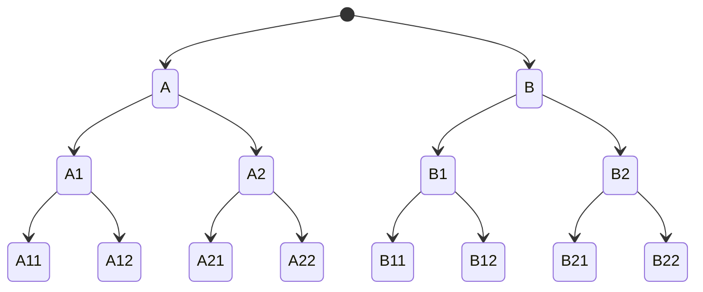

---
tags:
  - database
  - db-format
date: 2024-08-12
aliases:
  - BtrBlocks
---
> [!info]- 참고한 것들
> - [[(논문) BtrBlocks - Efficient Columnar Compression for Data Lakes|풀 논문 정리본]]

> [!info] 원본 논문
> - 이 글은 [BtrBlocks: Efficient Columnar Compression for Data Lakes](https://dl.acm.org/doi/10.1145/3589263) 에서 핵심 아이디어만 요약한 글입니다.
> - 별도의 명시가 없으면, 본 논문에서 그림을 가져오거나 주인장이 직접 그렸습니다.

## 요약정리

- BtrBlock 은 효율적인 compression 을 지원하는 (fast decompression + high compression ratio) columnar data format 이다.
- 풀 논문 정리본은 [[(논문) BtrBlocks - Efficient Columnar Compression for Data Lakes|여기]] 에 돼있고, 여기에는 로직만 실압근으로다가 정리해놓을거다.
	- Motivation, evaluation 등은 저기서 확인하자.

### Scheme Pool

- Decompression 이 빠른 8개 (기존것 7개 + 새로운 것 1개) 의 scheme 으로 scheme pool 을 구성한다.
	- [[Run Length Encoding, RLE (Encoding)|RLE]]
	- One Value: 모든 값이 동일한 RLE
	- [[Dictionary Encoding (Encoding)|Dictionary]]
	- [[Huffman Coding (Encoding)|Frequency]]
	- [[Patching, Mostly Encoding (Encoding)|Patched]] [[Frame Of Reference, FOR (Encoding)|FOR]] + [[Bit Packing, BP (Encoding)|BP]]
	- [[Fast Static Symbol Table, FSST (Encoding)|FSST]]
	- [[Roaring Bitmap (Encoding)|Roaring Bitmap]]
	- [[4. Pseudodecimal encoding (BtrBlocks, SIGMOD 23)|PDE]]

### Cascading Compression

![[btrblocks_pg33.png]]

- 전체 구조는 다음과 같음: column 하나를 64,000 entry 씩 block 으로 묶은 단위로 compression 을 진행
- 그리고 column 하나는 하나의 BtrFile 이 된다
- 이때 저 가운데 부분이 어떻게 되는지 보자

#### Entrypoint: Pick and Compress

![[btrblocks_pg34-1.png]]

- 처음에 block 은 *Pick and compress* 과정으로 들어간다.
	- 코드상으로는 [CSchemePicker::compress](https://github.com/maxi-k/btrblocks/blob/master/btrblocks/compression/SchemePicker.hpp) 에 해당한다.
- 여기서 하는 역할은 크게 (1) Scheme selection 과 (2) Compress 로 나눌 수 있다.
- 그럼 입력된 block 으로 scheme selection 을 어떻게 하는지 보자.

#### Scheme Selection

![[btrblocks_pg35-1.png]]

- 처음에는 block 의 자료형에 따라 적용할 수 없는 scheme 들은 걸러낸다.
- 그리고 block 으로부터 통계를 구하고, 이것으로 heuristic 을 돌려 추가적으로 몇가지의 scheme 을 더 걸러낸다.
	- 구하는 통계에는 min, max, unique value count, avg. run length 등이 포함된다. ([코드 예시 - Number 자료형](https://github.com/maxi-k/btrblocks/blob/master/btrblocks/stats/NumberStats.hpp))
	- 그리고 heuristic 으로 추가적인 필터링을 하는 것은 (3) 번째 단계에서 실제로 compression 을 해보며 compression ratio 가 가장 높은 놈을 고를건데, 이때 compression 을 돌려볼 scheme candidate 를 최대한 줄이기 위해서이다.
		- 너무 candidate 가 많으면 이 (3) 번 과정이 너무 오래걸리니까.
		- 이건 코드상으로는 모든 scheme 들이 상속받는 `Scheme::isUsable()` 함수에서 구체적인 heuristic 을 확인할 수 있다.
			- 대부분의 scheme 들은 그냥 `true` 를 반환한다. 즉, heuritic filtering 없이 그냥 pass 되는 셈.
			- [PDE::isUsable()](https://github.com/maxi-k/btrblocks/blob/master/btrblocks/scheme/double/Pseudodecimal.cpp#L476-L483): Unique < 10%
			- [FSST::isUsable()](https://github.com/maxi-k/btrblocks/blob/master/btrblocks/scheme/string/Fsst.cpp#L119-L129)
				- Unique < 50% (of not NULL)
				- Total length > FSST_CONFIG_THRESHOLD
			- [StringDynDict::isUsable()](https://github.com/maxi-k/btrblocks/blob/master/btrblocks/scheme/string/DynamicDictionary.cpp#L586-L605)
				- When FSST is not available
				- Unique < 50% (of not NULL)
			- 근데 일부 scheme 에서는 이 함수 말고 다음 단계에서 heuristic 이 적용되기도 한다.
- 마지막으로는 sample 을 채취해 그것에다 직접 compression 해보고, compression ratio 가 가장 높은 놈을 선택하게 된다.
	- 이건 모든 scheme 들이 상속받는 `Scheme::expectedCompressionRatio()` 함수를 호출하는 것으로 수행된다.
	- 공통적으로는 하나의 candidate scheme 에 대해 compression 를 하고, 그 결과를 cascading 하는 방식으로 수행된다.
		- 여기서부터 머리속이 복잡해진다: scheme selection 을 위해서는 compression 이 들어가고, compression 을 위해서 scheme selection 을 하는 loop 이 생기기 때문.
		- 이건 [[#Scheme Selection Loop|뒤에서]] 더 알아보자.
	- 다만 어떤 scheme 의 경우에는 sample 을 compression 하는 것으로 compression ratio 를 예측하기 힘든 경우도 있다.
		- 가령 FSST 는 sample 로는 실제 compression ratio 를 파악하기 힘들다. 따라서 이놈에 대해서는 expected compression ratio 를 무조건 `1`로 반환한다.
		- [FSST::expectedCompressionRatio()](https://github.com/maxi-k/btrblocks/blob/master/btrblocks/scheme/string/Fsst.cpp#L10-L15)

#### Scheme Selection Loop

- 우선 각 scheme 을 적용하는 것은 `Scheme::compress()` 함수로 수행된다.
- 즉, sample 은 일단 candidate scheme 중 하나로 compress 된다.

![[btrblocks_pg36-1.png]]

- 그리고 그 결과는 다시 [[#Entrypoint Pick and Compress|pick and compress]] 로 들어간다.
- 즉, 하나의 scheme 을 적용한 결과에 대해서 동일한 과정을 거쳐 그 결과를 또 다시 compress 하게 되는 것.

![[btrblocks_pg37-1.png]]

- 그렇다고 무한정 이 cascading 을 반복하지는 않는다. 최대 3번까지만 반복함.
- 이렇게 함으로써 어떤 한 scheme 에서 시작하는 (이걸 root scheme 이라고 부르자.) 모든 가능한 cascading 을 거치게 되고,
- 이때 가장 compression ratio 가 높았던 root scheme 하나를 최종적으로 선택하게 된다.
- 가령 candidate scheme 으로 `A`, `B` 가 있었다고 해보자. (즉, root scheme 은 `A` 와 `B` 이다.)
- 그리고 각자의 결과는 `A` 의 경우에는 `A1`, `A2` 로 cascading 될 수 있고, `B` 의 경우에는 `B1`, `B2` 가 가능하다고 해보자.
- 마찬가지로 `A1` 의 결과는 `A11`, `A12` 로 cascading 되는 식으로 진행된다고 해보자. 그럼 다음과 같은 tree 가 만들어 진다.

- 이때 `A --> A1 --> A11` 부터 `B --> B2 --> B22` 까지의 모든 경우의 수에 대한 compression ratio 를 계산하여, 가장 compression ratio 가 좋았던 root scheme (즉, `A` 혹은 `B` 일 것이다.) 을 최종적인 scheme 으로 고르게 된다.

#### Compression Loop

- 위 과정을 거치게 되면, scheme 하나가 결정될 것이다.
- 그리고 이 과정을 block 에 대해서도 동일하게 반복한다 (...)
- 즉, 다음과 같이 scheme 이 결정됐다고 할 때

![[btrblocks_pg39-1.png]]

- 이것은 그 결정된 scheme 으로 compression 되고

![[btrblocks_pg41-1.png]]

- 다시 [[#Entrypoint Pick and Compress|pick and compress]] 로 돌아가 반복한다.

![[btrblocks_pg42-1.png]]

## Sampling

- 위에서 sampling 하는 것은 그냥 지나쳤는데, 구체적으로는 다음과 같이 수행된다.

![[Pasted image 20240719175037.png]]

- Block 의 전체 64,000 개의 entry 를 6,400 개씩 묶어 partition 을 하고,
- 그 partition 내에서 랜덤한 offset 으로부터 64 개의 entry 를 꺼내어 합친다.
- 그럼 partition 10 개에서 64개씩 꺼내게 되므로 총 640 개의 entry 가 나오므로, 전체 block 의 1% 를 sampling 하는 셈이다.