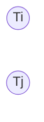
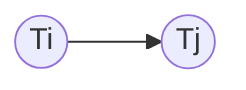

---
tags:
  - database
  - originals
  - snu-bkms24f
date: 2024-11-11
---
> [!info] 서울대학교 데이터사이언스대학원 정형수 교수님의 "데이터사이언스 응용을 위한 빅데이터 및 지식 관리 시스템" 강의를 필기한 내용입니다.
> - [[(SNU GSDS) Bigdata and Knowledge Management Systems 01|목차]]

## Transaction Processing

- 지금까지 배운 layered architecture 는 하나의 query 를 처리할 때의 처리 과정이고
- Transaction processing 은 이런 query (하나 이상) 여러개를 ACID 하게 처리하기 위한 component 이다.
- 여기에서는 concurrency control 이랑 recovery 가 중요하다.
	- Concurrency control: Race condition 을 피해 lost update 같은 문제가 발생하지 않도록 하는 것.
		- Lost update: 다른 update 가 기존의 update 를 덮어써 기존의 update 의 효력이 없어지는 것
		- 이놈은 operator execution, access method, buffer manager 에서 사용된다.
	- Recovery: Atomicity 와 durability 를 위해서, commit 뿐 아니라 abort, fail 시에도 항상 일관된 상태를 보존하기위해
		- 이를 위해서 logging 을 한다: 뒤에서 설명
		- 이놈은 buffer manager, storage manager 에서 사용된다.

## Transaction (Txn)

- 사용자가 지정한 atomic 한 operation 들의 묶음을 말한다.
	- 보통 뭐 `BEGIN TRANSACTION` 으로 시작해 `COMMIT` (혹은 `ABORT`) 으로 끝나는 단위가 하나의 txn 이다.
- DB 의 change 의 기본 단위이다.
	- 알다시피 single query 도 txn 이다

### Interleaving

- Txn processing 의 strawman approach 는
	- 한 txn 을 serial 하게, 한번에 하나씩만 처리하면 correct 할 것이다.
	- 혹은 txn 이 생성될때마다 database 전체를 복사해 거기에서 작업하게 해도 될 것이다.
- 하지만 당연히 이렇게 하면 너무 느리다.
- 그래서 "여러개의 txn 의 operation 들을 막 섞어서 (interleaving) concurrent 하게 수행해도 serial 한 것이랑 동일한 상태 (Equivalent) 가 되게 해야 한다" 가 concurrency control 의 목표이다.
- 이렇게 interleaving 을 하는 것은 utilization 과 throughput 을 높이고, user response time 을 줄이기 위해서이다.
- Interleaving 을 하면 잠시 correctness 가 깨질 수는 있지만 txn 종료 뒤에는 항상 보장되어야 한다.
	- 즉, partial txn 같은 것은 없다.

### Annotations

- Database object 는 대문자 알파벳으로 표기한다 ($A$, $B$ ...).
	- 임의의 "Object" 에 대한 ACID 를 제공하는 것이 txn 이기 때문에 이 대상이 record 이든 뭐든 별로 상관 없지만
	- 편의상 record 라고 생각하자.
- Operation 은 read 는 $R(A)$ 으로, write 는 $W(B)$ 으로 표기한다.
- Txn 은 이 operation 의 묶음이다.
- Txn $i$ 에 대해 `BEGIN` 은 $B_{i}$ 로, `COMMIT` 은 $C_{i}$ 로, `ABORT` 는 $A_{i}$ 로 표시한다.

### ACID

- ACID 는 txn 이 보장해야 하는 조건들이자, txn 의 correctness criteria 이다.
- *Atomicity*: All or nothing - `COMMIT` 되면 전부 저장되어야 하고 `ABORT` 되면 하나도 저장되지 말아야 한다.
	- Recovery module 은 이것이 잘 지켜지도록 DBMS init 시에 log 를 보며 저장할 것은 저장하고, 지울것은 지운다.
	- 즉, database 에 `COMMIT` 된 애들만 있고 `ABORT` 된 것은 아무것도 저장되지 않게 하는 것이 atomicity 이다.
- *Consistency*: It looks corrent to me - 사용자가 지정한 “일관된 데이터의 조건” 이 지켜지고 있는지
	- 이 "사용자가 지정한 일관된 데이터의 조건" 을 *Integrated Constraint* (*IC*, 무결성 조건) 이라고 한다.
	- 대표적으로 *FK Constraint* 가 있다.
	- Txn boundary 에서 이 *IC* 를 체크한다: 시작할때, 종료될때 한번씩
	- 따라서 constraint 가 많을 수록 느려지게 된다.
- Durability: Survive failures - `COMMIT` 시에 모든 것이 정상적으로 "저장"되는 것.
	- 어떤 failure 시에도 `COMMIT` 된 데이터는 permanent 하게 남아있어야 한다.
- Isolation: as if alone - 혼자 접근해서 사용하고 있는 것처럼 보이게 하는 것
	- 즉, 결과물을 serial execution 과 동일하게 하는 것
- AD 를 recovery module 이, I 는 concurrency module 이 핸들링한다.

## Atomicity

- Txn 의 시작과 끝을 기준으로 데이터가 저장되거나 저장되지 말거나 (all or nothing).
- `ABORT` 일 때와 crash 상황 두가지의 scenario 를 처리해야 한다.

### Approach 1: Logging

- 어떤 작업을 했는지 전부 기록 (log) 한 다음에 `COMMIT` 되지 않으면 log 를 보고 이것을 UNDO 한다.
	- 만약 `ABORT` 가 떨어지면, 그 즉시 UNDO 를 하게 되고
	- Crash 가 나게 되면 DBMS init 시에 recovery module 이 UNDO 를 하게 된다.
- 따라서 log 에는 이전의 상태로 restore 하기 위해 필요한 정보가 전부 있어야 한다.
	- 가령 old value 와 new value, 어떤 txn 이 어디를 고쳤는지 등.

### Approach 2: Shadowing

- Copy-on-write 하는 것을 다른말로 shadowing 한다고 생각하면 된다.
- 이렇게 생긴 copy 본을 shadow page 라고 한다.
- `COMMIT` 시에는 shadow 로 pointer 만 연결해주면 되고 `ABORT` 시에는 그냥 이 shadow 들을 버리면 된다
	- 즉, instrant recovery 가 가능하다.
- IBM System R 에서 처음 등장한 기법인데
- 단점은
	- 근데 COMMIT 에 pointer 를 바꿔주기 위해서도 shadowing 이 필요하기 때문에 shadow propagation 이 발생할 수 있다고 한다. [^shadow-propagation]
	- 그리고 page 전체를 shadowing 하기 때문에 갖고있어야 하는 page 들이 너무 많아 memory pressure 가 발생하게 된다.
## Consistency

- Database 에 의해 표현되는 세상은 "Logically" correct 하고, 따라서 이 database 에 대한 query (question) 도 "Logically" correct 한 응답을 받아야 한다.
	- 인데 별로 감이 안오는 정의이긴 하다.
- 다음의 두가지 정도로 나눠진다.
- *Database consistency*: Database 는 세상을 "Logically" correct 하게 묘사하고, 이를 위해 user 는 schema 에 IC (*Integrity Constraint*, 위에서 말했쥬?) 를 추가하게 된다.
	- 정의한 IC 를 강제하는 것이 database consistency 라고 이해하면 된다.
- *Transaction consistency*: 이것은 database 가 consistent 한 상태에서 txn 이 시작되었으면, txn 이 끝날때도 consistent 해야 한다는 것이다.
	- 이것은 근데 DBMS 에서 강제하기는 어려운 것이고, application 에서 지켜야 하는 부분이라고 한다.

## Isolation

- Isolation 은 txn 이 혼자 작동하는 것과 같은 효과를 내게 하는 것이고, txn 들을 interleaving 해서 performance 를 올리면서도 isolation 을 보장하는 기법을 concurrency control 이라고 한다.
	- Interleaving 이 performance 를 올리는 것은 stall 상황에 다른 txn 의 operation 을 실행할 수 있기 때문이다.
	- 즉, 하나의 txn 이 page fault 등의 상황으로 잠시 stall 된다 하더라도 다른 txn 을 실행시킬 수 있기 때문.
- 즉, *Concurrency Control* 은 isolation 을 보장하기 위한 txn interleaving protocol 이라고 할 수 있는 것.
- 취하는 전략은 크게 두가지로 나뉜다.
	- *Pessimistic Concurrency Control* (*PCC*): Race 가 언제든 발생할 수 있다고 예상하고 (비관적, pessimistic) 사전에 전부 체크하는 것.
		- 사전에 최대한 대비를 해놓기 때문에 나중에 고쳐야 하는 경우가 “잘” 없다.
		- 가끔 있기는 하다는 소리.
	- *Optimistic Concurrency Control* (*OCC*): Race 가 발생하지 않을 것이라고 생각하고 (낙관적, optimistic) 발생하면 그때 고치는 방식.
		- 즉, 선 실행 후 검사 및 조치한다.
		- 보통 조치는 `ABORT` 하고 retry 하는 식이다. 따라서 conflict 가 발생했을 때에 penalty 가 생긴다.
		- Txn 이 많이 몰리는 hot spot (적은 데이터에 많은 txn 이 몰리는 경우 - *skewness* 라고 한다.) 의 경우에는 OCC 의 성능이 바닥을 친다.
			- 하지만 PCC 는 이때에도 꾸준하게 나온다.
		- 하지만 txn 이 모든 다른 데이터에 접근하는 등의 상황에서는 OCC 가 겁나게 빠르게 작동한다.
	- 보통 DBMS 에서는 이것을 configurable 하게 해주기도 한다.
		- 뭐가 좋다기보다는 각자 잘 작동하는 상황이 있기 때문에, 본인의 workload 특성을 보고 어떤 전략으로 concurrency control 을 할 것인지 DBMS user 가 결정하도록 하는 것.
- 참고로 index concurrency 에서 latch coupling 은 in-memory data structure 에 대해 operation 간의 concurrency control 이고, 여기서의 Isolation 은 disk data 에 대한 multi-txn concurrency control 을 말한다.

> [!info] 여기부터는 `2024-11-13` 강의

### Example

- 예시를 한번 보자. 다음은 두 txn 을 serial 하게 실행했을 때의 결과이다.

![[Pasted image 20241210100831.png]]

- 보면 두 txn 이 실행되는 순서에 따라서 값이 바뀔 수는 있지만, A 와 B 의 총합은 일정하다.
	- `BEGIN` 순서는 중요하지 않고, 이때문에 바뀌는 것 또한 별로 중요하지 않다.
	- 중요한 것은 correctness 이다.
		- 위 예제에서는 $T_{1}$ 에서 A 는 B 에게 100원을 전달했고, $T_{2}$ 에서는 A 와 B 모두에게 6% 의 이자를 지급했다.
		- 그럼 전달하고 이자를 지급하든, 이자를 지급하고 전달하든 총량은 바뀌지 않아야 한다는 점에서 correctness 가 지켜지고 있는 것.

![[Pasted image 20241210101430.png]]

- 위는 성공적인 interleaving 의 예시이다.

![[Pasted image 20241210101736.png]]

- 근데 위 예시에서는 correctness 가 깨졌다.
	- 여기서 consistency 가 깨진 이유는 `A=A-100` 을 해서 총액이 달라진 상황에서 T2 가 전부 실행되었기 때문이다.
	- SMO latch coupling 과 유사한 상황이다: read 시점에서의 가정이 write 시점에는 달라졌기 때문

### Definitions

- *Serial Schedule*: Txn 들의 operation 들이 하나도 interleaving 되어 있지 않은 txn schedule 을 말한다.
- *Equivalent Schedules*: 두 txn schedule 이 *Equivalent* 하다는 것은, 두 schedule 의 결과물이 동일한 "효과" 를 가짐을 의미한다.
	- 가령 위의 예제에서는 $A+B$ 가 동일한 것이 동일한 "효과" 를 가진다는 것을 의미한다.
- *Serializable Schedule*: 어떤 txn schedule 이 *Serializable* 하다는 것은, 해당 schedule 이 *Serial Schedule* 과 *Equivalent* 하다는 것을 의미한다.
	- 그리고 이런 *Serializable Schedule* 을 *Correct* 하다고 한다.
- *Conflict*: 다음과 같은 조건을 만족할때, *Conflict* 상황이라고 부른다.
	1) 둘 이상의 txn 의 operation 이어야 한다: 당연히 하나의 txn 이면 애초에 serial 하다.
	2) 그 operation 이 같은 공간 (같은 key 에 대한 value 등) 에 접근한다.
	3) 두 operation 중 하나 이상은 반드시 write operation 이어야 한다.
	- 다만, conflict 는 반드시 문제가 되는게 아니라 문제가 발생할 여지가 있다 정도로 생각하면 된다.

### Anomaly (Isolation level)

- RW conflict 가 발생하면 다음과 같은 이상현상 (anomaly) 이 관측 될 수 있다.
	- 다만 얘네들은 read-write conflict 라는 동일한 원인에서 기인하는 건데, 발생하는 조건만 다른것이다. 원인이 같다고 해서 다 똑같은거 아니야? 라고 생각하지 말자.
#### Unrepeatable Reads

![[Pasted image 20241210104949.png]]

- 하나의 txn 에서 같은 데이터를 두번 읽었을 때 그 둘의 값이 달라지는 것
- 이건 중간에 다른 txn 이 끼어들어서 값을 바꿨기 때문에 발생한다.
- 다른말로는 *Inconsistent Read* 라고도 한다.

#### Dirty Reads

![[Pasted image 20241210105850.png]]

- 다른 txn 이 변경한 데이터를 읽어서 처리했는데, 그 txn 이 `ABORT` 된 경우를 말한다.
	- 즉, 다른 txn 이 write 해서 dirty 가 된 것을 읽었는데, 그놈이 `ABORT` 된것.
- 이건 해당 txn 이 `COMMIT` 혹은 `ABORT` 될때까지 본인의 `COMMIT` 을 미루는 것으로 해결할 수는 있다.
	- 근데 문제는 이런 dependence chain 이 길어지면 하나가 abort 가 되었을 때 연속적으로 abort 가 발생하는 문제가 생긴다
	- 이것을 *Cascading abort* 라고 한다.
- 즉, 이건 uncommitted write 를 read 하기 때문에 발생하는 것이기에, *Reading Uncommitted Data* 라고도 부른다.

#### Overwriting Uncommitted Data

![[Pasted image 20241210105916.png]]

- Dirty read 와 비슷한데, uncommitted data 를 read 한 것뿐만 아니라 그 값을 가지고 새로운 값을 write 까지 하는 경우를 말한다.

- 위의 conflict anomaly 들을 보면, concurrency control 에서는 이런 conflict 가 일어나더라도 correct 한 schedule 을 실행해야 함을 알 수 있다.

### Conflict Equivalent

- 다음의 두 조건을 갖추는 두 schedule 을 *Conflict Equivalent* 하다고 한다.
1. 일단 두 schedule 에서의 동일한 txn 은 동일한 작업을 해야 한다.
	- 즉, $S_{1}$ 에서 $T_{1}$ 이 $R(A) \rightarrow R(B) \rightarrow W(A) \rightarrow W(B)$ 를 한다면
	- $S_{2}$ 에서도 $T_{1}$ 은 $R(A) \rightarrow R(B) \rightarrow W(A) \rightarrow W(B)$ 를 해야 한다는 것.
2. 그리고 conflict order 가 동일해야 한다.
	- 즉, $S_{1}$ 에서 $T_{1}$ 이 $R(A)$ 를 하고 $T_{2}$ 이 $W(A)$ 를 한다고 해보자.
	- 그리고 $S_{2}$ 에서는 $T_{1}$ 에서 $R(A)$ 를 하고 (중간에 뭐 또 다른 operation 이 실행된 다음에) $T_{2}$ 에서 $W(A)$ 한다면
	- Conflict 는 있지만 이들의 순서가 같기 때문에, 즉 conflict order 가 preserve 되기 떄문에 이때 *Conflict Equivalent* 하다고 한다.

### Conflict Serializable

- 만약에 어떤 concurrent schedule 이 serial schedule 과 conflict equivalent 하다면, 이때를 *Conflict Serializable* 하다고 한다.
- 정의는 이런데, 어떤 schedule 이 *Conflict Serializable* 한지는 다음처럼 판단할 수 있다.
	- 만약 두 txn 을 돌리는 schedule 에 대해
	- Conflict 가 나는 operation 들은 가만히 냅두고
	- Conflict 가 안나는, 서로 다른 txn 의 연속된 operation 두개의 순서를 뒤집어본다 (swapping).
	- 그리고 이것을 계속 했을 때 Serial scheduling 과 동일해지면 이때 해당 schedule 은 *Conflict Serializable* 한 것이다.
	- 근데 만약 자리를 바꾸지 못하는 conflict operation 들이 있다면 이때는 *Conflict Serializable* 이 아니다.
		- 즉, 오도가도 못하는 상황이 발생한다면 *Conflict Serializable* 이 아닌 것.
- 예시를 보면 좀 더 이해가 잘된다.

#### Example

##### Conflict Serializable Case

- 다음의 schedule 을 보자.

![[Pasted image 20241210113031.png]]

- 일단 여기서 conflict 는 $W(T_{1},A) \rightarrow R(T_{2},A)$ 와 $W(T_{1},B) \rightarrow R(T_{2},B)$ 두개가 있다.
	- 저거 빨간 화살표는 conflict 가 아니다. 속지 말자.
- 이때 저 빨간 화살표로 표시된 $W(T_{2},A)$ 와 $R(T_{1},B)$ 는 conflict 가 아니다. 이 두놈의 자리를 바꿔보면 아래와 같이 된다.

![[Pasted image 20241210113604.png]]

- 마찬가지로 빨간 화살표로 표시된 $R(T_{2},A)$ 와 $R(T_{1},B)$ 는 conflict 가 아니기 때문에 얘도 순서를 바꿔본다. 그럼 아래와 같이 된다.

![[Pasted image 20241210113718.png]]

- 여기서도 빨간 화살표로 표시된 $W(T_{2},A)$ 와 $W(T_{1},B)$ 는 conflict 가 아니기 때문에 얘도 순서를 바꿔본다. 그럼 아래와 같이 된다.

![[Pasted image 20241210113816.png]]

- 계속 똑같은 짓만 반복하긴 하는데, 마지막으로 한번만 더 해보자. 빨간 화살표로 표시된 $R(T_{2},A)$ 와 $W(T_{1},B)$ 는 conflict 가 아니기 때문에 얘도 순서를 바꿔본다. 그럼 아래의 그림에서 왼쪽과 같이 된다.

![[Pasted image 20241210113919.png]]

- 보면 왼쪽의 schedule 이 serial schedule 과 같아진 것을 볼 수 있다. 따라서 해당 schedule 은 *Conflict Serializable* 하다.

##### Non-conflict Serializable Case

![[Pasted image 20241210114109.png]]

- 반면에 위의 예시에서 왼쪽을 보면 consecutive non-conflict operation 이 $R(T_{1},A)$ 와 $R(T_{2},A)$ 밖에 없는데, 이놈을 swapping 해봐도 오른쪽의 serial schedule 이 안나온다.
- 따라서 이때는 *Conflict Serializable* 하지 않다.

#### Dependency Graph

- 위와 같이 swapping 하는 방법은 직관적이긴 하지만, 이것을 알고리즘으로 만들기는 힘들고 그리고 txn 이 여러개일 경우 경장히 복잡해진다.
- 따라서 *Dependency Graph* (혹은 *Precedence Graph*) 을 그려서 이것을 판단하는 방법이 제시된다.
	- 이렇게 precedence graph 를 그린 다음 cycle 이 있으면 abort 시키는 concurrency control 방법이 2011 에 Patrick O'Neil (LSM tree 저자) 교수님이 발표했다고 한다.
- 그리는 방법은:
- 우선 각 txn 들이 node 가 된다. 여기서 두 txn $T_{i}$ 와 $T_{j}$ 가 있다면, 다음처럼 된다.

- 이때 $T_{i}$ 의 한 operation $O_{i}$ 과 $T_{j}$ 의 한 operation $O_{j}$ 간에 conflict 가 있으면 둘 간에 edge 가 그려지게 되는데 이때의 direction 은 우선 실행되는 operation 에서 edge 가 나와서 나중에 실행되는 operation 으로 들어가게 된다.
- 가령 $O_{i} \rightarrow O_{j}$ 순서로 실행된다면

- 와 같이 그려지게 되는 것.
- 이와 같은 graph 를 그렸을 때, [[Directed Acyclic Graph, DAG (Data Structure)|DAG]] 가 된다면 고놈은 *Conflict Serializable* 하다.

##### Example

- 가령 다음의 예시는 Cycle 이 생기므로 *Conflict Serializable* 하지 않다.

![[Pasted image 20241210120129.png]]

- 그리고 다음의 예시는 DAG 이므로 *Conflict Serializable* 하다.

![[Pasted image 20241210120245.png]]

### Serializability and Concurrency Control

- 어떤 conflict serializable schedule 이 serializable schedule 로 바꿀 수 있다는 것이 이미 알려져 있을때, 이때의 serializable schedule 에서의 txn 순서는 가장 처음 나오는 conflict 순서에 따라 결정된다.
	- 즉, 만약 $T_{1}$ 의 operation 이후에 $T_{2}$ 의 operation 와 conflict 가 난다면, 이 schedule 을 serializable schedule 로 바꾼다면 반드시 $T_{1}$ 이후에 $T_{2}$ 가 나오게 된다.
	- Serializable schedule 로 바꾸면 첫번째 conflict 순서를 보존하는 방향으로 txn 순서가 바뀐다는 것.
- 이것이 Pessimistic Concurrency Control 의 기본 원리이다:
	- 이런 첫 conflict 순서를 detect 하기 위해서 *Lock* 이 사용되는 것이고,
	- *Lock* 을 이용해서 첫 conflict 를 detect 한 다음에는 후순위의 txn 을 hold 해버려 serializable schedule 로 바꾸는 것이 *PCC* 인 것이다.

### Types of Schedules

![[Pasted image 20241210121717.png]]

- 여기까지 나온 Schedule 의 종류들을 다이어그램으로 그려보면 대강 위처럼 나온다.
- 참고로 DBMS 에서 "Serializable Isolation 을 지원한다" 라고 한다면 이 방식으로 txn scheduling 을 하고 있는 것이다.

## Durability

- Durability 는 `COMMIT` 된 내용이 persistent 해야 한다는 것이다.
- 이것을 보장하는 방법은 Recovery 파트에서 배우도록 하자.

[^shadow-propagation]: 이 문제를 [[Flash Friendly File System, F2FS (File System)|F2FS]] 에서는 indirection 으로 해결했다. 여기서는 그런 방법을 안썼을까?