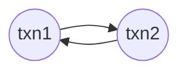

---
tags:
  - database
  - originals
  - snu-bkms24f
date: 2024-11-27
title: 21. Multi-Version Concurrency Control (Bigdata and Knowledge Management Systems 1, SNU GSDS)
---
> [!info] 서울대학교 데이터사이언스대학원 정형수 교수님의 "데이터사이언스 응용을 위한 빅데이터 및 지식 관리 시스템" 강의를 필기한 내용입니다.
> - [[(SNU GSDS) Bigdata and Knowledge Management Systems 1|목차]]

## MVCC

- MVCC 는 PCC 나 OCC 와는 무관한 design principle 이고, DBMS 에서는 MVCC 위에다가 PCC, OCC 를 구현한다.
	- PCC, OCC 는 모두 concurrency control protocol 이고, MVCC 에서는 얘네들 중 하나를 골라 같이 사용한다.

![[Pasted image 20241210182606.png]]

- 알다시피 MVCC 에서는 single logical object 에 대해 여러 version 의 multiple physical object 가 있다.
	- Txn 이 write 를 할때는 해당 object 에 대한 새로운 version 을 만들게 된다.
- Txn 시작시에 snaphot 을 할당받게 되고, 이것으로 내가 어떤 version 을 읽을 수 있는지 (즉, *Visibility*) 결정한다.
	- 이 snapshot 은 단순하게는 timestamp 라고 생각해도 되고
	- PostgreSQL 에서는 xid (txn ID) 및 같이 실행되고 있는 xid 들을 snapshot 으로 받게 된다.
	- Snapshot 이라는 이름처럼 시간이 멈춰있는 효과를 주기 위함이다.
- MVCC 는 RW 간의 block 이 없기 때문에 아주 빠르다.
	- 다만 WW blocking 은 있다. WW conflict 의 경우에는 PCC 를 사용한다면 block 되고, OCC 를 사용한다면 일단 실행 후 validation phase 에서 처리된다.

## MVCC Example

- 다음의 $A$ 에 접근하는 txn $T_{1}$ 와 $T_{2}$ 을 살펴보자.
- 우선 $W(T_{1},A)$ 는 새로운 version $A_{1}$ 을 만들고 $A_{0}$ 의 $TS_{END}(A_{0})$ 에다가는 $TS(T_{1})=1$ 을 적는다.

![[Pasted image 20241210183638.png]]

- 다음으로 $R(T_{2},A)$ 를 처리할 때는 $A_{0}$ 를 읽게 된다.
	- 왜냐면 Txn status table 을 봤을때 $T_{1}$ 이 아직 살아있기 때문.

![[Pasted image 20241210183700.png]]

- 그리고 $W(T_{2},A)$ 를 처리할 때는 stall 된다.
	- 이것도 Txn status table 을 봤을때 $T_{1}$ 이 아직 살아있기 때문.
	- 여기서 PCC 를 사용했을 때랑 OCC 를 사용했을 때가 나뉘게 된다. PCC 에서는 block 되고, OCC 에서는 local workspace 에 적고 나중에 validation 에서 처리된다.

![[Pasted image 20241210183724.png]]

- R(T_{1},A) 에서는 본인이 생성한 version 인 A_{1} 를 읽어간다.

![[Pasted image 20241210183814.png]]

- $T_{1}$ 이 `COMMIT` 한 뒤에는, (PCC 기준) $T_{2}$ 의 block 이 풀리고, 그제서야 새로운 version $T_{2}$ 를 적는 것과 $TS_{END}(A_{1})=2$ 로 업데이트하는 작업을 해준다.

![[Pasted image 20241210183854.png]]

## Tuple Format

![[Pasted image 20241210185319.png]]

- 위에서 본것처럼 visibility 를 위해서 각 tuple 에는
	- `TXN_ID`: 해당 tuple 을 생성한 txn 의 ID
	- `BEGIN_TS` (PostgreSQL 에서는 `xmin`): 이놈을 볼 수 있는 최소 $TS$
	- `END_TS` (PostgreSQL 에서는 `xmax`): 이놈을 볼 수 있는 최대 $TS$
		- 이때 `BEGIN_TS`, `END_TS` 를 *Visibility Window* 혹은 *Version Lifetime* 이라고 부른다.
	- `POINTER`: Version chain pointer
- 가 추가적으로 담긴다.

## Version Storage

- 우선 version search 를 위한 search structure (version search index) 가 필요하다.
	- 저 index 는 primary B+index 와는 다르다.
	- 보통 version chain 으로 관리된다.
	- 당연히 version chain 이 길어지면 search 에 오래걸린다.
	- 또한 B+index 는 이 version chain 의 head 를 가리킨다고 한다.
- 그리고 이 version 들을 담을 저장공간이 필요한데, 여기에는 여러 choice 들이 있다.

### Storage Layout

![[Pasted image 20241210190047.png]]

- *Append-only*, *In-row*, *Full-versioning*: Table 에 full version 을 놓고 pointer 는 다음 version 의 table row 를 가리키도록 하는 것
	- 단점은 update 가 index SMO 를 유발한다는 것이고
	- 장점은 version 이 바로 옆에 있기 때문에 recovery 가 빠르다
	- psql 에서 사용 - pvs: persistence version store 라고 부른다

![[Pasted image 20241210212211.png]]

- *Off-row*, *Time-travel storage*: version 을 별도의 공간 (Time-travel table) 에 저장하는 것

![[Pasted image 20241210212232.png]]

- *Delta*: 변경된것만 저장하는 것
	- space benefit 이 있지만
	- delta apply (reconstruct) overhead 가 있다
	- 보통 Off-row 방식을 같이 사용해서 delta 를 별도 space 에 저장한다.
		- 이 공간을 undo space 라고 한다
	- mysql, oracle 등등이 이방식

### Version Order

- Version 을 저장하는 순서에 대해서도 choice 가 있다.
	- *Old-to-New* (*O2N*): 다음 버전을 가리키는 것
	- *New-to-Old* (*N2O*): 이전 버전을 가리키는 것

### DBMS's Choices

![[Pasted image 20241210212500.png]]

- 그래서 MySQL 하고 PostgreSQL 을 비교해보면 대략 위 그림처럼 정리된다.
	- MySQL 에서는 Off-row, Delta, N2O versioning 을 하고
	- PostgreSQL 에서는 In-row, Full, O2N versioning 을 한다.

## GC

- MVCC 에서는 versioning 을 하는 만큼, 오래된 version 들은 지워줄 필요가 있다.

### GC Target: Visibility, Dead zone

- 일단 어떤 tuple 을 볼 수 있는 txn 이 아무도 없으면 걔가 GC target 이 된다.
- 기본적으로는 그냥 시간이 지나서 tuple 에 접근하는 txn 이 다 없어져서 target 이 되는데,
- 이것 말고도 다음처럼 version chain 중간에 target 이 되는 경우도 생긴다.

![[Pasted image 20241210212829.png]]

- *Dead Zone*: 연속된 두개의 txn 의 begin time 들의 time period 를 *Dead Zone* 이라고 한다.
- *Visibility*: 어떤 tuple 의 `BEGIN_TS` 와 `END_TS` 사이의 구간은 해당 tuple 을 볼 수 있는 time period 이므로 *Visibility* 라고 한다.
- 만약 어떤 tuple 의 visibility 가 저 dead zone 에 들어간다면, 이 tuple 은 아무도 접근하지 못하는 놈이 된다.
- 이런 tuple 들은 지워주는게 좋지만 아직까지는 별 뾰족한 수가 없다고 한다.
	- 논문들이 나오고있긴 하지만 아직까지 해결되지 않은 문제
	- 중간에꺼를 지우고 version chain pointer 를 concurrent 하게 하는 것이 생각보다 쉽지 않고
	- IO overhead 때문에 naive 하게 하면 성능이 망해버린다고 한다.
		- 그래서 in-memory DB 에서는 저런거를 지워주는 기능을 제공하기도 한다.
	- 그래서 지금은 저런 애들도 그냥 냅두고 그냥 옛날의 version 들을 한번에 truncate 할때 같이 GC 되도록 하는 방법을 사용한다.

### Tuple-level GC

- 각 tuple 을 하나하나 보면서 GC 하는 방법을 *Tuple-level GC* 라고 한다.
	- 이것 말고도 txn 들이 자신의 read, write 을 생성하고, 이것을 기반으로 DBMS 가 직접 어떤 version 이 더이상 visible 하지 않는지 판단하여 GC 하는 *Transaction-level GC* 도 있다고 한다.
- 여기에도 두가지 방식이 있다:
	1) Background Worker
	2) Cooperative Cleaning

#### Background Worker

- 이거는 GC 를 담당하는 worker thread 가 주기적으로 생성돼서 GC 하는 것을 의미한다.

![[Pasted image 20241210214733.png]]

- 위 그림처럼 table 을 쭉 훑으면서 하나하나 GC 를 하거나
	- 위 그림에서는 thread 1 이 담당한다고 생각하면 된다.
	- 이놈의 $TS(T_{1})=12$ 이므로 $TS_{END}(X) \le 12$ 인 애들을 전부 지우게 된다.

![[Pasted image 20241210214747.png]]

- 아니면 위처럼 bitmap 으로 표시해뒀다가 한번에 지우는 방법도 있다고 한다.
- 대부분의 DBMS 들이 이런 tuple-level GC 를 한다.
	- PostgreSQL 에서는 *Vacuumer* 라는 process 가 담당하고
	- MySQL 에서는 *Purger* 라는 thread 가 담당한다.

#### Cooperative Cleaning

![[Pasted image 20241210214817.png]]

- *Cooperative Cleaning* 은 별도의 background worker 가 없고, txn worker thread 가 직접 version chain 을 traverse 하면서 지우는 방식이다.
	- 즉, 위 그림처럼 txn worker 가 B+index 를 타고 해당 record 로 간 다음에, visible 한 version 을 찾기 위해 chain 을 traverse 할 때 GC 도 같이 해주는 것.

## Snapshot Isolation (SI)

- *Snapshot Isolation* (*SI*) 라는 것은 MVCC 가 제공해주는 또 다른 isolation level 이다.
	- 이것은 Repeatable Read 와 유사한 격리 수준을 보여준다고 한다.

### Snapshot Read

- *Snapshot* 은 txn 이 `BEGIN` 할 때 받게 되고, 이것보다 이전에 commit 된 object 만을 볼 수 있다.
- 따라서 각 txn 은 "정지화면" 을 보는 듯한 느낌을 받게 되고, 이 정지해 있는 (것처럼 보이는) database 의 모습을 *Snapshot Database* 라고 한다.
- 그리고 이 *Snapshot Database* 만을 읽게 하는 read 정책이 *Snapshot Read* 이다.
- 이것은 대부분의 read anomaly 를 해결해준다.
	- Dirty Read: snapshot 기준 commit 된 object 만 볼 수 있기 때문에, uncommitted data 를 읽을 수 없고, 따라서 해당 data 를 사전에 변경한 놈이 abort 되지도 않는다. 따라서 dirty read 는 불가능하다.
	- Inconsistent Read: 당연히 commit 된 object 만 보므로 read 의 결과는 항상 동일하다.
	- Phantom Read: 중간에 다른 txn 이 끼어들어서 `INSERT` 를 해봤자 snapshot 에 의해 걸러져서 안보인다. 따라서 Phantom Read 도 불가능하다.

### First-Committer-Wins Rule

- MVCC 에서는 version write 를 하기 때문에 RW conflict 는 무의미하다. 어차피 RW conflict 가 일어나도 내가 write 한 것을 저놈은 못읽기 때문.
- 하지만 WW conflict 는 유의미하다. 여러 버전 중에 어떤 놈을 취할것이냐에 대한 정책을 정해야 하기 때문.
- SI 에서는 이것에 관해 *First-Committer-Wins* 정책을 사용한다.
	- 즉, WW conflict 가 발생했을 때, 먼저 commit 하는 놈이 승자이고, 나머지는 txn 들은 `ABORT` 된다.
- 하지만 이건 구현하기가 아무래도 힘들기 때문에, 대부분의 DBMS 에서는 *First-Writer-Wins* 로 살짝 변형해서 지원한다.
	- 즉, 해당 object 에 lock 을 잡고, 이것으로 conflict 를 detect 해서 늦은놈은 전부 `ABORT` 시키는 것.
	- 물론 OCC 에서처럼 local copy 에 write 를 한 다음에 commit 시점에 validation 을 할 수도 있다. 근데 구현이 복잡해서 별로 선호하지는 않는다고 한다.

### Write Skew

- 위에서 말한것 처럼, SI 는 Repeatable Read 정도의 isolation level 을 가지고 있다: 이말은, Serializable 은 아니라는 것이고, serialize 할 수 없는 schedule 도 존재한다는 의미이다.
- 그 상황이 바로 이 *Write Skew Anomaly* 이다. 그림으로 알아보자.

![[Pasted image 20241211024300.png]]

- 위와 같은 example 이 있다고 해보자.
	- $T_{1}$ 은 전부를 읽어 흰색 바둑돌을 검은색으로 바꾸려고 하고, $T_{2}$ 은 전부를 읽어 검은 바둑돌을 흰색으로 바꾸려고 한다.
- 만약에 이것을 serial 하게 실행하면
	- $T_{1} \rightarrow T_{2}$ 로 실행하면 $T_{1}$ 이 전부 검은색으로 바꿨다가 $T_{2}$ 이 전부 흰색으로 바꿔 전부 흰색이 될 것이고,
	- $T_{2} \rightarrow T_{1}$ 로 실행하면 $T_{2}$ 이 전부 흰색으로 바꿨다가 $T_{1}$ 이 전부 검은색으로 바꿔 전부 검은색이 될 것이다.
- 이것을 MVCC 로 실행한다고 해보자. 그럼 commit 전에는 아래처럼 될 것이다.

![[Pasted image 20241211024800.png]]

- $T_{1}$ 은 본인의 snaphot database 에서는 아래 두개가 흰색이므로 이것을 검은색으로 바꿀 것이다. 이것이 위의 상황이다.
- $T_{2}$ 은 본인의 snapshot database 에서는 위 두개가 검은색이므로 이것을 흰색으로 바꿀 것이다. 이것이 아래의 상황이다.
- 이때 이 둘이 commit 을 하게 되면 결과적으로는 이렇게 된다.

![[Pasted image 20241211024952.png]]

- 맨 오른쪽이 최종 결과가 되는데, 이것은 어느 serial schedule 에서도 볼 수 없는 결과이므로 serializable 하지 않다.
	- 이게 가능한 이유는 MVCC 에서는 WW conflict 에 대해서만 제약을 두는데, 이때는 WW conflict 가 일어나지 않기 때문이다.
	- $T_{1}$ 은 아래 두개, $T_{2}$ 는 위 두개에 write 를 하므로 WW conflict 가 없다.
	- 그래서 각자 write 를 하면 오른쪽의 모습이 나오는 것.
- 근데 여기에는 RW conflict 가 있다. $T_{1}$ 가 write 하는 곳은 $T_{2}$ 가 읽은 곳이고, $T_{2}$ 가 write 하는 곳은 $T_{1}$ 가 읽은 곳이기 때문.
- 따라서 아래와 같은 precedence graph 가 그려지고, 이것이 cycle 이기 때문에 serializable 하지 않게 된다.

### But... SI

- 근데 그래도 이런 anomaly 는 극히 드물고, MVCC 가 주는 성능이 아주 좋기 때문에 보통 DBMS 에서는 MVCC 를 사용하고, SI 를 isolation level 로서 제공한다.
- SI 가 포함된 isolation level 을 다시 그림으로 그려보면 아래와 같다.

![[Pasted image 20241211025730.png]]

- 사실상 Repeatable Read 에서도 Snapshot Read 를 사용하기에, 둘 간의 차이는 write 에서 기인하는 것이라고 한다.