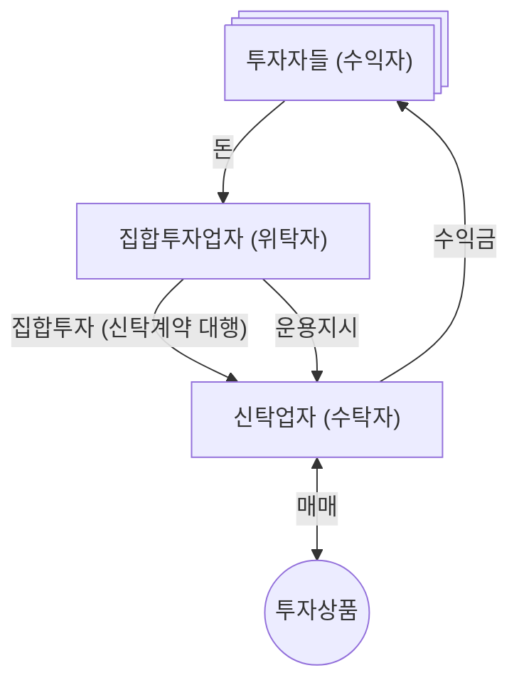

---
tags:
  - mdg
  - finance
date: 2026-07-09
aliases:
  - 투자신탁
  - 신탁업자
  - 집합투자신탁
---
> [!info] 작물단계: #seed 

> [!info] 참고한 것들
> - [법제처 생활법률정보 (집합투자기구의 유형)](https://www.easylaw.go.kr/CSP/CnpClsMain.laf?csmSeq=572&ccfNo=3&cciNo=1&cnpClsNo=2)
> - [법제처 생활법률정보 (집합투자기구와 펀드)](https://easylaw.go.kr/CSP/CnpClsMain.laf?popMenu=ov&csmSeq=572&ccfNo=3&cciNo=1&cnpClsNo=1)
> - [법제처 생활법률정보 (집합투자재산의 보관 및 관리)](https://easylaw.go.kr/CSP/CnpClsMain.laf?popMenu=ov&csmSeq=572&ccfNo=5&cciNo=2&cnpClsNo=1)
> - [법제처 논설 (증권투자신탁의법률관계)](https://www.moleg.go.kr/mpbleg/mpblegInfo.mo?mid=a10402020000&mpb_leg_pst_seq=125252)

## 란?

- *투자신탁* 이란 [[집합투자, 펀드 (자본시장)|집합투자]] 를 하기 위해 결성된 [[신탁, Trust (법률)|신탁]] 을 일컫는다.
	- 그래서 *집합투자신탁* 이라고도 한다.

## 투자신탁의 구조

- 근데 문제는 법조문을 보면 굉장히 꼬롬하다.

> [!quote] 자본시장법 제9조 제18항
> 집합투자업자인 위탁자가 신탁업자에게 신탁한 재산을 신탁업자로 하여금 그 집합투자업자의 지시에 따라 투자ㆍ운용하게 하는 신탁 형태의 집합투자기구

- [[신탁, Trust (법률)|신탁]] 에서는 [[신탁, Trust (법률)|위탁자]] 가 돈을 맡기고, [[신탁, Trust (법률)|수탁자]] 가 관리를 하며, 그 수익은 [[신탁, Trust (법률)|수익자]] 가 가져간다. 이런 구조에서 보면 위 문장이 이해되지 않는다.
	- 집합투자업자가 자신의 돈을 맡기는게 아닌데 왜 위탁자야??
	- 자신의 돈을 맡기는건 투자잔데 왜 투자자가 위탁자가 아닌거지??
- 근데 생각해보면 이건 [[집합투자, 펀드 (자본시장)|집합투자]] 의 특성을 생각하면 당연한거다.
	- 집합투자는 2명 이상의 투자자가 돈을 모아서 투자하는거다. 그럼 ==그 돈을 모은 사람이 위탁자== 가 되는 것이 당연하다.
	- 가령 투자자 각자가 위탁자가 된다고 생각해보자. 그럼 2명 이상의 투자자가 돈을 모은 것이 아니다. 따라서 집합투자가 아닌것이다.
- 따라서 집합투자업자가 여러 투자자들로부터 돈을 모아서 신탁계약을 하게 되고, 따라서 집합투자업자는 ==투자자들이 개별적으로 해야 했을 신탁계약을 대행하는 위치== 에 있다고도 말할 수 있다.
	- 그래서 [자본시장법 제188조](https://www.law.go.kr/법령/자본시장과금융투자업에관한법률/(20260317,21061,20250916)/제188조) 에서도 집합투자업자를 신탁을 설정하는 (즉, 맡기는) 위탁자로 지정한다.
	- 즉, 투자자가 직접 신탁계약을 맺지 않고 집합투자업자를 통해서 하도록 indirection 이 되어있는 셈이다.
- 관계를 그려보면 대략 이렇게 된다.
	- 물론 실제는 더 복잡하다.
		- 투자자들이 집합투자업자에게 돈을 모으는 것은 [[집합투자, 펀드 (자본시장)|집합투자증권]] 을 사는 것으로서 구현된다. 따라서 투자자들과 집합투자업자 사이에 '증권상품판매회사' 가 낀다.
	- 이건 그냥 신탁관계 / 집합투자관계를 표현하기 위해 단순화한 것이다.

## 왜 이렇게 할까?

> [!info] 참고한 것들
> - [자본시장법 제244조 (선관주의의무)](https://www.law.go.kr/법령/자본시장과금융투자업에관한법률/(20260317,21061,20250916)/제244조)

- 근데 왜 집합투자업자가 직접 운용하면 안되는걸까? 왜 굳이 신탁업자랑 신탁계약을 맺어야 하는걸까?
- 그건 ==신탁업자가 집합투자업자의 투자금 운용을 견제하기 위함== 이다.
	- 신탁업자는 [[선관주의의무 (민사)|선관주의의무]] 를 가지고, 투자자들을 위한 선량한 행동을 해야 할 의무를 법적으로 ([자본시장법 제244조](https://www.law.go.kr/법령/자본시장과금융투자업에관한법률/(20260317,21061,20250916)/제244조)) 부여받는다.
	- 이러한 의무에 따라, 신탁업자가 지시한 운용방침이 법적으로 어긋나지 않는지, 그리고 투자자에게 유리한지 등을 검토한 다음 문제가 없을 때에만 실제 매매를 한다.
	- 이에 따라 신탁업자는 집합투자업자와 연관성이 없는 독립적인 주체가 하도록 가능한 대상을 제한한다.