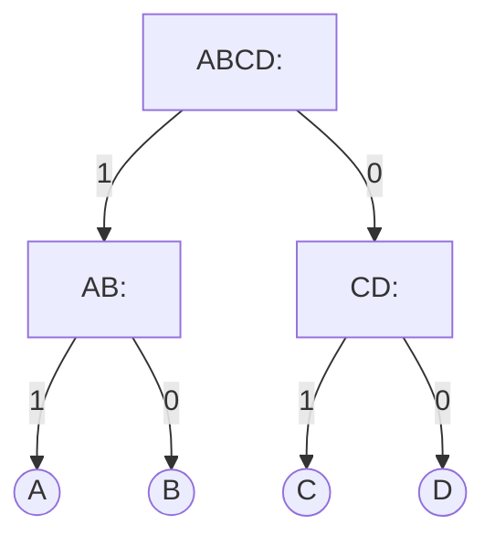
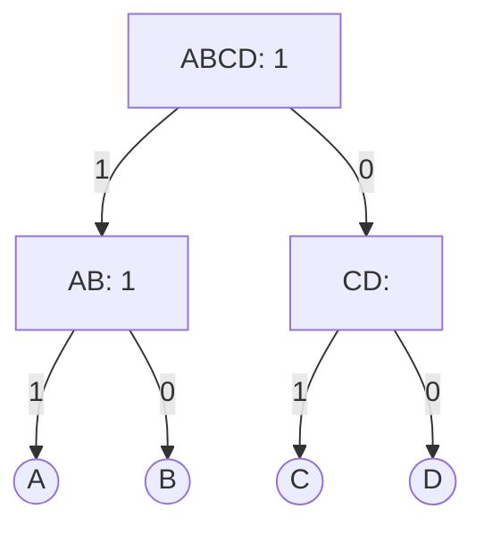
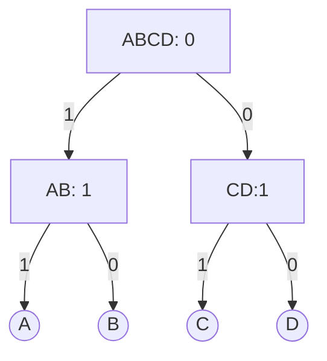

---
tags:
  - os
  - terms
  - os-replacement
aliases:
  - Pseudo-LRU
date: 2024-12-03
---
> [!info]- 참고한 것들
> - [[10. Caches|서울대 이재진 교수님 확장형 고성능 컴퓨팅 강의 (Fall 2024)]]

## Pseudo-LRU

- 이것은 decision tree 를 이용한 [[Least Recently Used, LRU (Replacement)|LRU]] approximate algorithm 이다.
- 핵심 아이디어는 binary tree 에서 node 의 값이 1이면 왼쪽 놈이 최근에 사용되었다는 의미이고, 0이면 오른쪽 놈이 최근에 사용되었다는 의미라고 정하고 access 될때 경로상에 있는 node 들의 bit 를 그에 맞게 바꿔 가장 이전에 사용되는 놈을 찻게 하는 것이다.

### 예시

- 예시를 보자. 다음과 같은 decision tree 가 있을때


- 만약 A 에 접근한다면, A 까지 가는 경로는 ABCD -> AB -> A 이다. 이때 가야하는 child 를 node 에 적어주면 다음과 같다.

- 따라서 A 가 접근되면, node 들의 bit 는 다음처럼 될 것이다.

| ACCESS | ABCD | AB  | CD          |
| ------ | ---- | --- | ----------- |
| A      | 1    | 1   | not changed |

- 다음은 C 에 access 되었다고 해보자. 그럼 ABCD -> CD -> C 이므로 node 에는 다음처럼 표시해 주면 될 것이다.

- 그럼 C 가 접근되었을 때의 경우의 수도 위의 표에 추가를 해보자.

| ACCESS | ABCD | AB          | CD          |
| ------ | ---- | ----------- | ----------- |
| A      | 1    | 1           | not changed |
| C      | 0    | not changed | 1           |

- 마친가지의 과정을 B 와 D 에 대해서도 생각해 보면, 다음과 같이 표가 만들어 진다.

| ACCESS | ABCD | AB          | CD          |
| ------ | ---- | ----------- | ----------- |
| A      | 1    | 1           | not changed |
| B      | 1    | 0           | not changed |
| C      | 0    | not changed | 1           |
| D      | 0    | not changed | 0           |

- 이렇게 access table 을 완성했다. 그럼 victim 은 어떻게 고를까.
- 아래의 상황에서 새로운 `E` 가 들어온다고 해보자.

- 일단 `ABCD` 가 `0` 이기 때문에 right child 보다 left child 의 애들이 더 예전에 접근되었을 것이다.
- 또한, `AB` 는 `1` 이기 때문에 left child 보다 right child 의 애들이 더 예전에 접근되었을 것이다.
- 따라서 victim 은 B 가 된다. 이것을 표로 나타내면

| ABCD | AB  | CD             | VICTIM |
| ---- | --- | -------------- | ------ |
| 0    | 1   | doesn't matter | B      |

- 이 원리를 확장해 저 표를 완성해보면

| ABCD | AB             | CD             | VICTIM |
| ---- | -------------- | -------------- | ------ |
| 0    | 0              | doesn't matter | A      |
| 0    | 1              | doesn't matter | B      |
| 1    | doesn't matter | 0              | C      |
| 1    | doesn't matter | 1              | D      |

- 이렇게 victim table 또한 완성할 수 있다. 이 access table 과 victim table 을 이용해 replace 하는 것이 *Pseudo-LRU* 이다.

### Performance

- 일단 성능으로 보자면, LRU 와 Pseudo-LRU 는 통계적으로 봤을때 miss rate 차이가 아주 적다고 한다.
- 또한 필요로 하는 bit 의 개수를 보면,
	- LRU 의 경우에는 cache size 가 4라면 $4! = 24$ 이므로 5bit 가 필요하다.
	- 하지만 Pseudo-LRU 의 경우에는 보다시피 3bit 만 있으면 된다.
	- 이것을 $N$ 으로 확장시키면, $(2^{log_{2}(N+1)}-1)-N$ 이라고 한다.