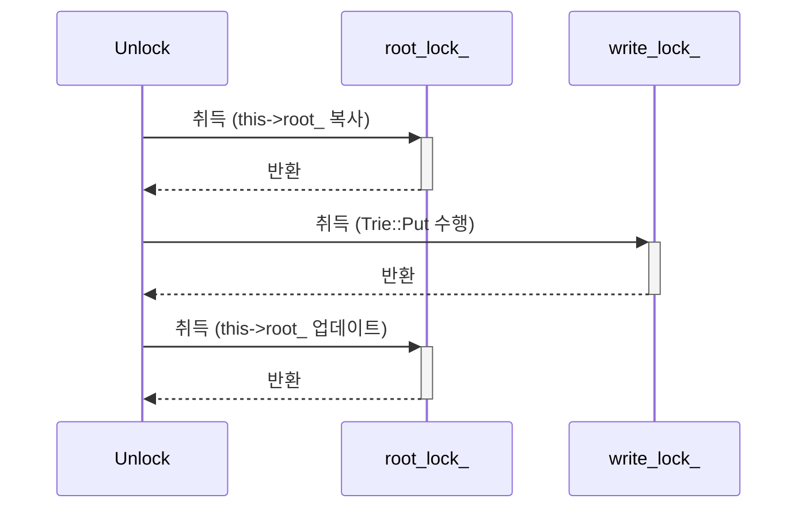
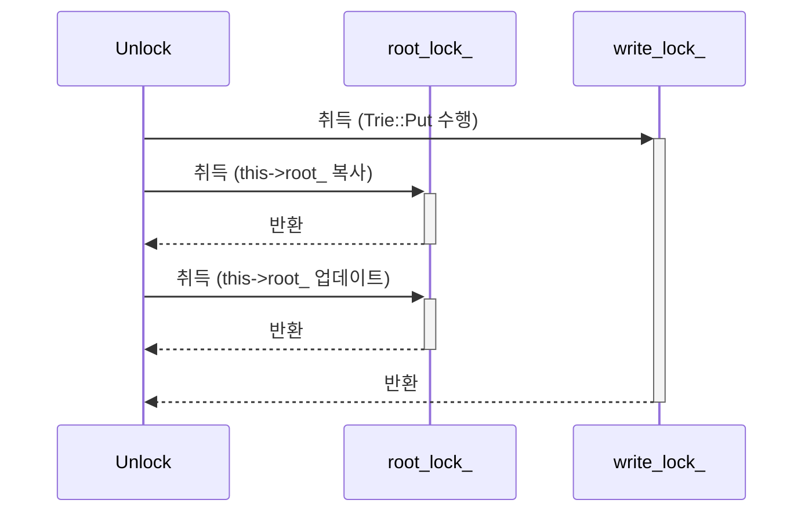

---
tags:
  - CMU-15445
  - Database
  - Bustub
date: 2024-07-01
---
> [!info]- 참고한 것들
> - [가이드](https://15445.courses.cs.cmu.edu/fall2023/project0/)

> [!info]- CodeRef (인데 private 이라 주인장만 볼 수 있음)
> - [Github](https://github.com/haeramkeem/bustub-private.idbs.fall.2023.cs.cmu.edu/pull/1)

## `heap-use-after-free` (1): `TrieStore::Put` 충돌

### 로그

- 충돌난 부분

```
#11 0x104d6f5bc in bustub::Trie bustub::Trie::Put<std::__1::basic_string<char, std::__1::char_traits<char>, std::__1::allocator<char>>>(std::__1::basic_string_view<char, std::__1::char_traits<char>>, std::__1::basic_string<char, std::__1::char_traits<char>, std::__1::allocator<char>>) const trie.cpp:67 ## root_ 노드 참조
```

- 해제하는 부분

```
#10 0x104db164c in bustub::Trie::operator=(bustub::Trie const&) trie.h:113 ## Trie 의 copy constructor
```

- 할당하는 부분

```
#3 0x104d6fd48 in bustub::Trie bustub::Trie::Put<std::__1::basic_string<char, std::__1::char_traits<char>, std::__1::allocator<char>>>(std::__1::basic_string_view<char, std::__1::char_traits<char>>, std::__1::basic_string<char, std::__1::char_traits<char>, std::__1::allocator<char>>) const trie.cpp:108 ## Trie::Put 의 스택 원소 합치는 부분
```

### 해결

- 위 문제는 `this->root_` 에 붙어서 `TrieStore::Put` 을 수행하는 도중에 누군가가 `this->root_` 를 변경하여 그 안의 node 들이 해제되는 것이 원인이었다.
 - 따라서 `this->root_` 에 붙을때와 `this->root_` 을 변경할 때 모두 `root_lock_` 을 걸어야 한다.
- 그리고 `TrieStore::Get` 의 Pseudo code 를 참고하면 (아마도 속도때문에) `this->root_` 에 붙을 때 메소드를 바로 호출하여 작업하는 전체에 대해 lock 을 걸지 말고, 이것을 local variable 에 복사하는 것만 lock 을 걸도록 유도하고 있어 그렇게 구현하는 것으로 해결.

## `heap-use-after-free` (1): `TrieStore::Get` 충돌

### 로그

- 충돌

```
#5 0x1042e555c in bustub::Trie::~Trie() trie.h:113 ## Trie 해제 작업
```

```
#7 0x1042e5504 in bustub::ValueGuard<std::__1::basic_string<char, std::__1::char_traits<char>, std::__1::allocator<char>>>::~ValueGuard() trie_store.h:14 ## ValueGuard 해제 작업
```

```
#27 0x1021dd6e4 in bustub::TrieStoreTest_MixedConcurrentTest_Test::TestBody()::$_1::operator()() const trie_store_test.cpp:120 ## Read 스레드
```

- 해제

```
#9 0x1042e555c in bustub::Trie::~Trie() trie.h:113 ## Trie 해제 작업
```

```
#11 0x1043781e0 in std::__1::optional<bustub::ValueGuard<std::__1::basic_string<char, std::__1::char_traits<char>, std::__1::allocator<char>>>> bustub::TrieStore::Get<std::__1::basic_string<char, std::__1::char_traits<char>, std::__1::allocator<char>>>(std::__1::basic_string_view<char, std::__1::char_traits<char>>) trie_store.cpp:25 ## TrieStore::Get 종료
```

```
#12 0x1042f56d8 in bustub::TrieStoreTest_MixedConcurrentTest_Test::TestBody()::$_1::operator()() const trie_store_test.cpp:120 ## Read 스레드
```

- 할당

```
#3 0x1043363e8 in bustub::Trie bustub::Trie::Put<std::__1::basic_string<char, std::__1::char_traits<char>, std::__1::allocator<char>>>(std::__1::basic_string_view<char, std::__1::char_traits<char>>, std::__1::basic_string<char, std::__1::char_traits<char>, std::__1::allocator<char>>) const trie.cpp:108 ## Trie::Put (스택 원소 합치는 부분)
```

```
#4 0x10437868c in void bustub::TrieStore::Put<std::__1::basic_string<char, std::__1::char_traits<char>, std::__1::allocator<char>>>(std::__1::basic_string_view<char, std::__1::char_traits<char>>, std::__1::basic_string<char, std::__1::char_traits<char>, std::__1::allocator<char>>) trie_store.cpp:37 ## TrieStore::Put
```

```
#5 0x1042eb3ac in bustub::TrieStoreTest_MixedConcurrentTest_Test::TestBody()::$_0::operator()() const trie_store_test.cpp:97 ## Write 스레드
```

### 해결

- 보니까 `ValueGuard` 를 생성할 때 `this->root_` 를 인자로 넣어주고 있었고, 이부분은 lock 이 걸려있지 않았기 때문에 발생하는 것이었다.
- 그래서 이때 `this->root_` 가 아닌 value lookup 에 사용한 root node (lock 걸고 복사해온) 를 넣어줌으로써 해결.

## Value mismatch + `stack-buffer-overflow`

### 로그

```
#5 0x10089ee00 in bustub::TrieStoreTest_MixedConcurrentTest_Test::TestBody() trie_store_test.cpp:142
```

- 위와 같은 에러가 뜨거나 아니면 예상되는 value 값이 나오지 않아 (가령 `key:00001` 에 대해 `new-value-00001` 이 나오지 않는 등) test 가 실패하였다.

### 해결

- 문제의 원인은 `TrieStore::Put` 중간에 다른 놈이 `this->root_` 를 덮어씌우게 되면 그놈은 overwrite 되어 사라지게 된다는 것이었다.



- 위 그림이 기존의 로직이었다.
- 즉, 기존의 로직은 `Trie::Put` 으로 새로운 root node 를 받아오는 동안에만 `write_lock_` 을 걸었기에, `this->root_` 가 덮어씌워지는 것이 가능했다.
	- 만약 `00000` 이 `write_lock_` 을 가지고 `Trie::Put` 을 수행하여 새로운 root 를 받아온 뒤, `write_lock_` 을 반환하였다고 해보자.
	- 그런데 이때 `this->root_` 를 업데이트하기 위해 `root_lock_` 을 잡기 전에 context switch 가 되어 `00001` 로 넘어갔다고 가정해보자.
	- `00001` 이 `Trie::Put` 으로 또 다른 root 를 받아온 뒤, 이놈은 `root_lock_` 까지 정상적으로 잡아 `this->root_` 를 업데이트한 뒤, `root_lock_` 을 반환하고 다시 context switch 가 일어나 `00000` 으로 넘어가면 어떻게 될까.
	- `00000` 은 `root_lock_` 을 받아 `this->root_` 를 업데이트하게 되어 전에 `00001` 이 업데이트한 `this->root_` 가 덮어씌워진다.
- 따라서 이것을 해결하기 위해 모든 과정에 `write_lock_` 을 잡고 있도록 바꿨다. 즉:



- 위와 같이 해결.