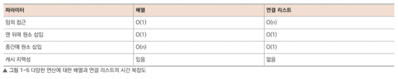

## Static, Dynamic

- **Static array**는 스택 메모리 공간에 저장되어 함수 등의 block이 끝나면 자동 해제된다. C언어에서는 다음과 같이 선언할 수 있다 - int staticArray[5];
- **Dynamic array**는 힙 메모리 공간에 저장되어 생성시점과 해제시점을 알아서 정해줄 수 있다. C언어에서는 다음과 같이 할당할 수 있다 - int* dynArray = (int*)malloc(5 * sizeof(int));
- 배열은 연속된 자료구조이기 때문에 한 인덱스에 접근했을 때 인접한 몇개의 원소를 캐쉬에 넣어둔다. 따라서 접근시간이 아주 빠르다. 이것을 **Cache locality**라고 한다(운체시간에 배운 그 지역성 맞음)
- 시간복잡도는 아래 사진 참고

