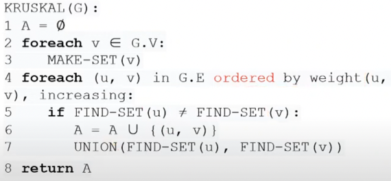
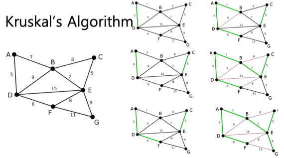
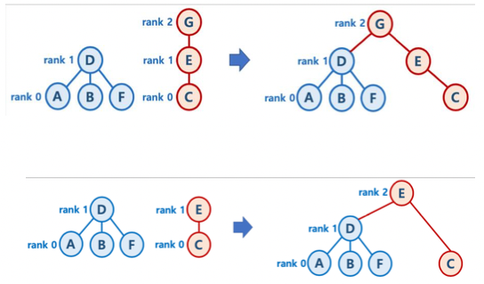
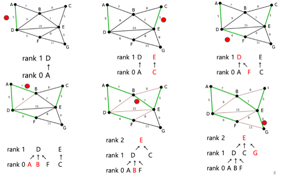

## Minimum cost Spanning Tree(MST)

- 일단 **Spanning Tree**는 Graph에서 모든 Node를 Edge로 연결하는 Tree이고
    - 중요한 점은 Tree이기 때문에 Cycle이 생겨서는 안된다는 것
- **최소비용 신장트리(Minimum cost Spanning Tree - MST)**는 Edge에 비용(Cost)가 할당되어있을때 비용의 총합이 최소가 되는 Spanning Tree를 말한다
    - 그냥 뭐 최소비용경로랑 똑같은듯
- 이때의 Tree의 Node갯수는 당연히 Graph의 Node갯수인 n개인데
- Tree의 Edge의 갯수는 Graph의 Edge의 갯수인 e개가 아니고 Node들을 일렬로 쭉 이어야 하기 때문에 **n - 1**개가 된다

### 용어정리

- 일단 용어정리 가 좀 되어있어야 함
- **Node - Vertex - V**가 같은말이고
- **Edge - Arc - Link - E** 가 같은뜻이다
- 그리고 **G=(V, E)**로 그래프를 나타낸다 - Vertex와 Edge의 집합

## Kruskal algorithm

1. 결과 집합인 A는 공집합으로 시작
2. 모든 Vertex에 대해 자기자신을 원소로 갖는 크기 1짜리 집합을 만들어준다
3. 그리고 Cost of Edge로 오름차순 정렬을 하여 Edge를 하나씩 선택한다
    - 위 그림에서 u와 v는 Edge의 양 끝 Vertex를 나타낸다 → (u, v)는 Vertex u와 v를 잇는 Edge인 셈
4. u가 포함된 집합이랑 v가 포함된 집합이 같지 않다면 해당 Edge를 A집합에 넣어주고 u가 포함된 집합이랑 v가 포함된 집합이랑 합집합해준다
    - u가 포함된 집합이랑 v가 포함된 집합이랑 같다면 Cycle이 발생하기 때문
    - 예를 들어 a-b-c가 연결되어있다고 해보자
    - 그럼 Edge(a-c)에 대해 a가 포함된 집합과 c가 포함된 집합은 모두 (a, b, c)이다
    - 따라서 a가 포함된 집합이랑 c가 포함된 집합은 같기 때문에 Edge(a-c)는 기각하는 것
    - 만일 저걸 포함시키면 a-b-c-a로 환형구조(Cycle)이 만들어져 트리가 되지 못한다
5. 이것을 반복해 모든 Vertex가 하나의 집합안에 들어오면 끝나게 되는 것

- 위 예시는 왼쪽 위부터 아래로 읽으면 됨
- 마지막 그림에서 B-C나 F-E가 선택되지 않는 것도 쟤네들을 선택하면 Cycle이 만들어지기 때문임

### Union by rank

- 뭐 C++에서의 std::set은 이미 트리구조로 구현되므로 문제는 없지만
- 어떤 노드 u가 노드 집합 S에 포함되는지 알아내기 위한 방법으로 선형 자료구조를 선택하면 탐색에 O(n)가 되어 결과적으로 Kruskal의 시간복잡도는 O(n^2)가 된다
- 따라서 집합을 트리구조로 표현하고 같은 집합에 포함되는지를 루트를 통해 알아내는 연산을 하면 더욱 빨라진다

- 따라서 **Union-by-rank**는 위와 같음
- 만일 두 트리의 높이가 다르다면 더 높은 트리의 루트의 자식으로 낮은 트리의 루트를 넣어준다
- 만일 두 트리의 높이가 같다면 둘 중 아무거나 선택한 후 그것의 루트의 자식으로 나머지 하나의 루트를 넣어준다
- 그럼 두 트리의 구성원소가 하나의 루트로 합쳐지므로 같은 집합으로 판단할 수 있는 것

- **Union-by-rank**를 도입한 Kruskal의 예시이다

## Prim algorithm

- 얘는 뭐 간단하다
- 시작노드를 하나 임의로 정하고 인접노드중에 비용이 제일 작은 것을 계속 선택하며 트리를 확장시켜나가는 개념
- Kruskal의 경우에는 트리가 여러개 만들어지고 얘네들을 합쳐나가는 과정이라면 Prim은 트리 하나를 계속해서 확장하는 과정이다

- 위 예시는 왼쪽 위부터 오른쪽으로 읽으면 됨
1. 먼저 0을 고르고
2. 인접 노드중에 비용이 작은거는 1이니까 1로 연결함
3. 2번과 7번 모두 비용이 8이기 때문에 임의로 7번을 골랐음
4. 그리고 인접한 2, 8, 6중에 6번이 제일 작으니까 6번을 고르고
5. 2, 8, 5중에 5번이 제일 작으니까 5번을 고르고
6. 이런식으로 하다보면 전체를 다 이어줄 수 있음
- 인접 노드중 가장 비용이 작은 것을 계속해서 선택해야 되므로 하나 움직일때마다 인접 노드를 비용에 따른 우선순위큐에 추가하고 최소를 pop하는 과정으로 다음 노드를 선택할 수 있다
