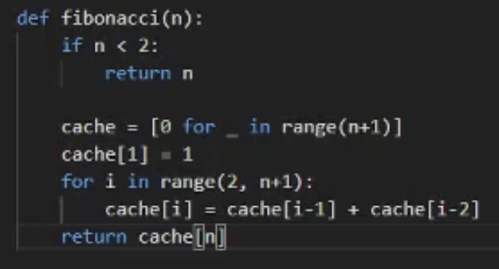
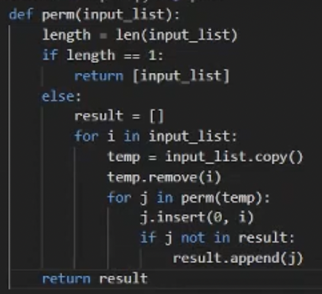

## Recursion

- 핵심은 문제를 유사한 형태의 작은 조각으로 나누기라는데
- 뭔소린지 대강 알겠제?
- 재귀의 경우 무한히 재귀적으로 돌릴 수 있는게 아니다 → Segmentation fault가 일어나지 않도록, 결과값의 자료형에따라 overflow가 일어나지 않도록, 그리고 파이썬같은 경우 재귀 횟수를 제한해둔 경우가 있으므로 이런 것을 고려해서 재귀를 돌려야 한다
- 그리고 재귀같은 경우에는 동일한 연산을 여러번 해야될 경우가 많으므로 DP를 이용해서 중복 연산을 줄이는 것이 도움이 된다

### 재귀를 사용하는 문제들

1. 피보나치 수열

- DP로 피보나치 수열 푸는 예제 기억해래이
1. 팩토리얼 - 순열 - 정수 n개를 나열하는 모든 경우의 수 - n!
    - 모든 경우를 나열하는 문제의 경우 재귀를 이용한 순열을 이용해 보자

- 순열 예제도 기억해래이
- 일단 arg는 리스트고 return은 입력된 리스트의 모든 나열 경우의 수를 담은 리스트의 리스트이다
- 즉, 이중 리스트인 셈
- 보면 입력 리스트의 원소 하나씩에 대해 이 원소를 prefix하기 위해 얘 하나를 빼고 permutation을 재귀로 돌려 그 결과를 받아온다
- 그리고 그 결과의 원소 하나씩에 대해 prefix했던 원소를 다시 넣어주고 반환할 리스트인 result에 존재하지 않는다면 result에 넣어준다
- 그리고 끝나면 result를 반환
1. **TSP(Traveling Salesman Problem)** : 출발점에서 중간지점을 모두 방문하고 목적지까지 가는 이동 경로 중 가장 짧은 경로
    - 이것도 노드 갯수가 적을 경우에 완전탐색을 해야 하므로 순열이 된다
    - 하지만 순열은 n!이므로 숫자가 큰 경우에는 이 방법을 쓰지 못한다
2. 계단 오르기 문제 : 한번에 1개 또는 2개의 계단을 오를 수 있을 때 10개의 계단을 오르는 경우의 수는
